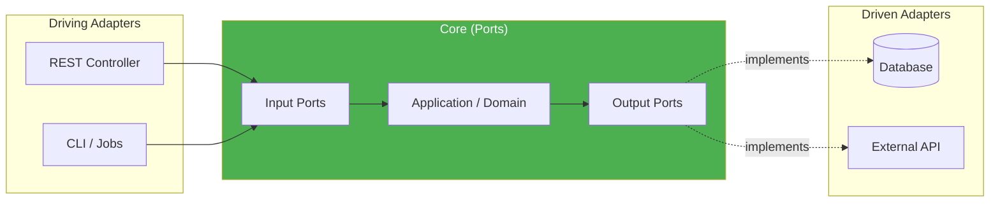
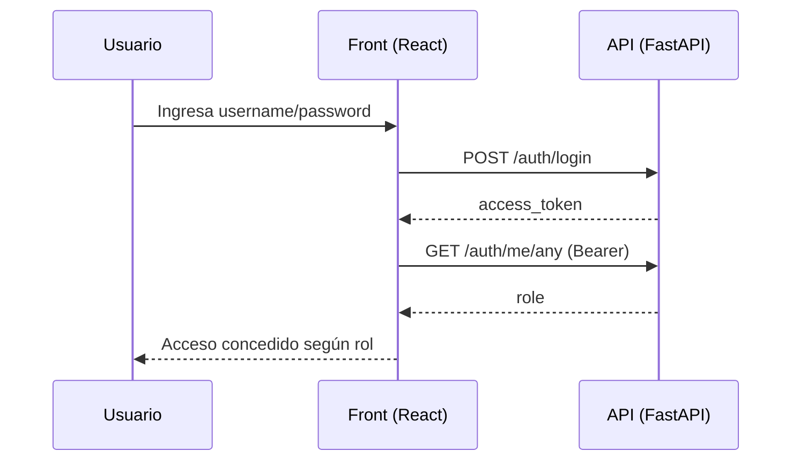
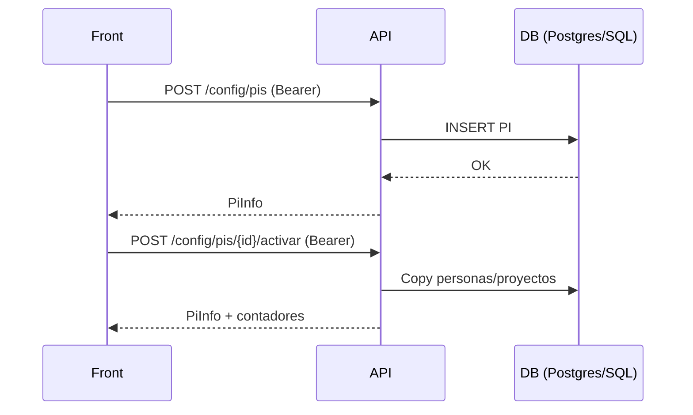
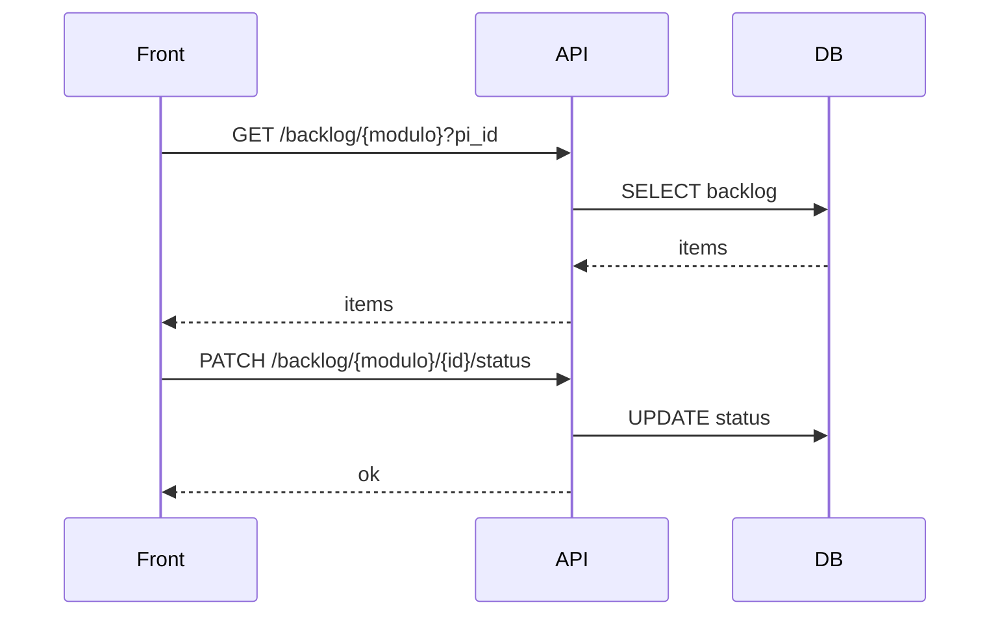
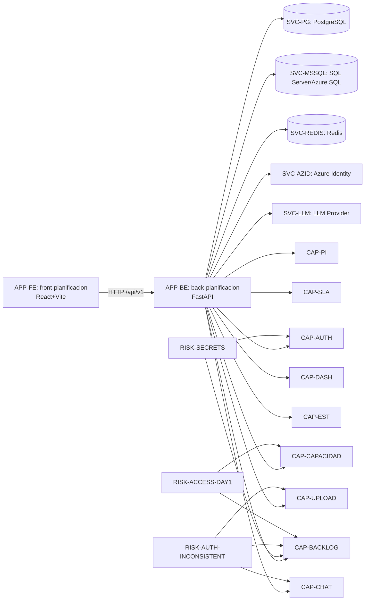

# Informe de Transición de Software

**Proyecto:** Allianz  
**Run ID:** `2026-05-18_19-09-05`  
**Fecha:** 18 de mayo de 2026  
**Generado por:** Agencia de Transición  

---


# Scout — Descubrimiento de Repositorios

**Proyecto:** allianz  
**Fase:** Scout  
**Fecha:** 2026-05-18 19:09:07  

---

**Total de ramas:** 1

**Rama seleccionada para análisis:** `main`

| Rama | Default | Protegida | Último Commit | Autor | Mensaje |
|---|---|---|---|---|---|
| **main** ← analizada |  |  |  |  |  |

---

*Generado por Agencia de Transición — 2026-05-18 19:09:07*

**Proyecto:** allianz  
**Fase:** Scout  
**Fecha:** 2026-05-18 19:09:07  

---

**Total encontrados:** 2

**Repositorio seleccionado para análisis:** `allianz`

| # | ID | Nombre | Visibilidad | Última Actividad | Rama Default |
|---|---|---|---|---|---|
| 1 | 1236990797 | **allianz** ← analizado | public | 2026-05-15 | main |
| 2 | 1174542182 | agenteBanco | public | 2026-03-09 | main |

---

*Generado por Agencia de Transición — 2026-05-18 19:09:07*


# Analyst — Stack y Calidad

**Proyecto:** allianz  
**Fase:** Analyst  
**Fecha:** 2026-05-18 19:09:07  
**URL:** https://github.com/jpguaqueta12/allianz.git  

---

### Stack Tecnológico

| Campo | Valor |
|---|---|
| Lenguaje Principal | Python |
| Tipo de Proyecto | Fullstack |
| Frameworks | FastAPI, React, Vite, LangChain, LangGraph |
| Bases de Datos | PostgreSQL, Redis, SQL Server |
| Infraestructura | Docker, GitHub Actions |
| Framework de Tests | Desconocido |

#### Distribución de Lenguajes

| Lenguaje | Archivos | % del Total |
|---|---|---|
| Python | 36 | 43.4% |
| TSX | 22 | 26.5% |
| TypeScript | 13 | 15.7% |
| SQL | 7 | 8.4% |
| JavaScript | 2 | 2.4% |
| Shell | 1 | 1.2% |
| HTML | 1 | 1.2% |
| CSS | 1 | 1.2% |

#### Entry Points

- `front-planificacion/src/types/index.ts`
- `back-planificacion/app/main.py`


### Score de Calidad: 42/100 🔴 (D)

| Elemento | Estado | Detalle |
|---|---|---|
| README | ❌ | Ausente |
| Tests | ✅ | Ratio: 4% |
| CI/CD | ✅ | Configurado |
| Dockerfile | ✅ |  |
| Linting | ❌ |  |
| LICENSE | ❌ |  |
| CHANGELOG | ❌ |  |
| .gitignore | ✅ |  |
| .env.example | ❌ |  |

---

*Generado por Agencia de Transición — 2026-05-18 19:09:07*


# Architect — Arquitectura

**Proyecto:** allianz  
**Fase:** Architect  
**Fecha:** 2026-05-18 19:09:07  
**URL:** https://github.com/jpguaqueta12/allianz.git  

---

### Resumen

| Campo | Valor |
|---|---|
| Estilo de Despliegue | Microservicio (MEDIA) |
| Patrón Principal | Hexagonal — Score: 16/100 |
| Confianza | BAJA |
| Violaciones | 0 |
| Servicios (monorepo) | 0 |

#### Evidencia Detectada

- Código: `(?i)interface\s+\w+Port\b` en 1 archivo(s)

### Patrones Secundarios

| Patrón | Score | Confianza |
|---|---|---|
| MVC | 16 | BAJA |
| Layered | 14 | BAJA |

### Patrones de Diseño (GoF)

| Patrón | Implementaciones | Archivos (muestra) |
|---|---|---|
| Observer | 1 | back-planificacion/app/services/cache_service.py |
| Middleware | 2 | front-planificacion/src/stores/authStore.ts, back-planificacion/app/main.py |

### Comunicación Externa

| Protocolo | Archivos |
|---|---|
| HTTP/REST | 3 |

### Diagrama de Arquitectura



---

*Generado por Agencia de Transición — 2026-05-18 19:09:07*


# Auditor — Seguridad

**Proyecto:** allianz  
**Fase:** Auditor  
**Fecha:** 2026-05-18 19:09:07  
**URL:** https://github.com/jpguaqueta12/allianz.git  

---

### Veredicto: ⚠️ RIESGO DETECTADO

### Secretos Expuestos (3)

| Tipo | Archivo | Línea | Severidad | Fragmento |
|---|---|---|---|---|
| generic_password | `back-planificacion/app/db/connection.py` | 35 | CRITICAL | pass************************** |
| generic_password | `back-planificacion/scripts/seed_azure_sql.py` | 46 | CRITICAL | pass***********************rn  |
| generic_password | `back-planificacion/scripts/test_sql_connection.py` | 40 | CRITICAL | pass******************rn " |

#### Recomendaciones

- **generic_password:** Usar variables de entorno o gestor de secretos

### Vulnerabilidades de Dependencias

> No se ejecutó análisis de CVEs o no se encontraron manifiestos.

---

*Generado por Agencia de Transición — 2026-05-18 19:09:07*


# Strategist — Roadmap de Transición

**Proyecto:** allianz  
**Fase:** Strategist  
**Fecha:** 2026-05-18 19:09:07  
**URL:** https://github.com/jpguaqueta12/allianz.git  

---

### Estrategia Seleccionada: **Rearchitect**

| Métrica | Valor |
|---|---|
| Índice de Deuda Técnica | 53/100 |
| Score de Calidad | 42/100 |
| Violaciones Arquitectura | 0 |
| Secretos Expuestos | 3 |
| Lenguaje Principal | Python |
| Patrón Actual | Hexagonal |

### Fase 1: Estabilización (Semanas 1-2) — Quick Wins

- [ ] Rotar 3 secreto(s) expuesto(s) en el código
- [ ] Crear `.env.example` con variables documentadas
- [ ] Agregar archivo `LICENSE`
- [ ] Actualizar dependencias con CVEs críticos

### Fase 2: Refactorización (Semanas 3-6)

- [ ] Aumentar cobertura de tests (actual: 4% → meta: 60%)
- [ ] Configurar herramienta de linting y formateo
- [ ] Mejorar documentación (README, comentarios, docstrings)
- [ ] Refactorizar módulos con alta complejidad ciclomática

### Fase 3: Modernización (Semanas 7-12)

- [ ] Migrar a infraestructura cloud / actualizar stack
- [ ] Implementar health checks y readiness probes

### Fase 4: Optimización (Semanas 13+)

- [ ] Agregar observabilidad (logs estructurados, métricas, trazas)
- [ ] Implementar quality gates en el pipeline CI/CD
- [ ] Documentación técnica completa (ADRs, diagramas actualizados)
- [ ] Revisión de performance y optimización de queries

### Estimación de Esfuerzo

| Fase | Duración | Riesgo | Impacto |
|---|---|---|---|
| Estabilización | 2 semanas | 🟢 Bajo | 🔴 Alto |
| Refactorización | 4 semanas | 🟡 Medio | 🟠 Alto |
| Modernización | 6 semanas | 🟠 Medio | 🟡 Medio |
| Optimización | Continuo | 🟢 Bajo | 🟢 Bajo |

---

*Generado por Agencia de Transición — 2026-05-18 19:09:07*


# Access Readiness — Accesos Día 1

**Proyecto:** allianz  
**Fase:** Access Readiness  
**Fecha:** 2026-05-18  
**RUN_DIR:** `.axetrules/output/allianz/2026-05-18_19-09-05/`  

---

### 📌 Resumen Ejecutivo

Este reporte valida la **preparación de accesos** para que el equipo entrante pueda operar el servicio desde el **Día 1** sin bloqueos.

**Resultado:** 🟡 *Parcialmente listo* — existen accesos verificables (GitHub) pero quedan **accesos no evidenciables** con la información actual (cloud, observabilidad, BD, secretos, ITSM).

> Nota: Este análisis se basa en evidencia disponible en los outputs CORE (Scout/Analyst/Architect/Auditor).  
> Para cerrar el gate “Día 1 listo” se requiere confirmación/inputs del equipo (cuentas, roles, URLs de herramientas, y pruebas de login).

---

### 🔎 Evidencia Analizada (inputs CORE)

- `01_scout/projects_discovered.md` (repositorios detectados y visibilidad)
- `01_scout/branches_discovered.md` (rama analizada)
- `02_analyst/stack_quality_report.md` (stack + CI/CD + Docker)
- `03_architect/architecture_report.md` (arquitectura y comunicaciones externas)
- `04_auditor/security_report.md` (secretos expuestos)

---

### ✅ Contexto del repositorio (verificable)

| Item | Evidencia | Estado |
|---|---|---|
| Repo principal | `jpguaqueta12/allianz` (GitHub) | ✅ Verificable |
| Rama analizada | `main` | ✅ Verificable |
| Clonado técnico | `/tmp/repo-intel/allianz@main` | ✅ Verificable |

---

### 🧩 Mapa de accesos requeridos (por categoría)

#### 1) Repositorios (GitHub)

| Sistema | Acceso mínimo | Evidencia | Estado |
|---|---|---|---|
| GitHub repo `allianz` | `Read` (clone) + `Write` (push PRs) | Pipeline CORE pudo clonar con TOKEN | ✅ OK (para el token configurado) |
| GitHub org/user `jpguaqueta12` | `Metadata/Contents Read` | Descubrió 2 repos | ✅ OK |

**Riesgo:** el token usado es un **PAT personal**. Para operación real se recomienda migrar a credencial corporativa / GitHub App / Fine-grained token por repo.

---

#### 2) CI/CD

| Sistema | Acceso mínimo | Evidencia | Estado |
|---|---|---|---|
| GitHub Actions | Lectura de workflows + runs | Detectado “GitHub Actions” (Analyst) | 🟡 Requiere validación (no se verificó acceso a Actions API/UI) |

**Acción sugerida:** confirmar que el equipo entrante tiene acceso a:
- `Actions` (lectura de runs, logs, artifacts)
- `Secrets/Variables` (solo si corresponde por rol)

---

#### 3) Infraestructura / Runtime

| Sistema | Acceso mínimo | Evidencia | Estado |
|---|---|---|---|
| Docker / Docker registry | Pull de imágenes (si aplica) | Detectado “Docker” (Analyst) | 🟡 Requiere validación |
| Orquestador (K8s / VM / PaaS) | Lectura de estado + reinicios controlados | No hay evidencia directa en outputs | ⚪ Desconocido |

---

#### 4) Bases de datos y storage

El stack reporta **PostgreSQL, Redis, SQL Server**.

| Sistema | Acceso mínimo | Evidencia | Estado |
|---|---|---|---|
| PostgreSQL | Usuario de lectura + esquema | Detectado en stack (Analyst) | 🔴 No evidenciado |
| Redis | Lectura/diagnóstico + flush limitado (según políticas) | Detectado en stack (Analyst) | 🔴 No evidenciado |
| SQL Server / Azure SQL | Lectura/diagnóstico | Detectado en stack (Analyst) | 🔴 No evidenciado |

---

#### 5) Observabilidad

| Sistema | Acceso mínimo | Evidencia | Estado |
|---|---|---|---|
| Logs centralizados | consulta + export | No hay evidencia directa | 🔴 No evidenciado |
| Métricas/APM | lectura dashboards + traces | No hay evidencia directa | 🔴 No evidenciado |
| Alerting/on-call | ver reglas + ack | No hay evidencia directa | 🔴 No evidenciado |

---

#### 6) Gestión de secretos (CRÍTICO)

El Auditor detectó **3 secretos expuestos en código** (passwords genéricos). Esto implica que el equipo entrante necesita:

| Sistema | Acceso mínimo | Evidencia | Estado |
|---|---|---|---|
| Gestor de secretos (Vault/ASM/AKV/etc.) | lectura (runtime) + rotación (admin limitado) | No hay evidencia del gestor | 🔴 No evidenciado |
| Repositorio | permisos para remover secretos y hacer PR | Token pudo clonar | ✅ OK |

---

#### 7) ITSM / Ticketing / Comunicación

| Sistema | Acceso mínimo | Evidencia | Estado |
|---|---|---|---|
| Jira/ServiceNow/Azure Boards | lectura + creación de tickets | No hay evidencia | ⚪ Desconocido |
| Canales de comunicación (Teams/Slack) | acceso a canales del servicio | No hay evidencia | ⚪ Desconocido |
| Wiki/Docs (Confluence/SharePoint) | lectura + edición | No hay evidencia | ⚪ Desconocido |

---

### 🚫 Bloqueos Día 1 (según evidencia disponible)

> Un “bloqueo” aquí significa: **no se puede confirmar con evidencia** que el acceso exista.

| Criticidad | Bloqueo | Por qué | Fecha límite |
|---|---|---|---|
| 🔴 BLOQUEANTE | Acceso a PostgreSQL/Redis/SQL Server | DBs detectadas pero sin credenciales/hosts/roles evidenciados | Día 1 |
| 🔴 BLOQUEANTE | Acceso a gestor de secretos | Hay secretos que deben rotarse; no se identifica el sistema de secretos | Día 1 |
| 🔴 BLOQUEANTE | Acceso a observabilidad (logs + métricas) | Sin observabilidad no hay operación segura | Día 1 |
| 🟠 NECESARIO | Acceso a GitHub Actions (runs/logs/artifacts) | Hay CI/CD; se requiere para investigar fallos de pipeline | Semana 1 |
| 🟡 DESEABLE | Acceso a registry / entorno de despliegue | Docker detectado; se requiere para operar despliegues | Semana 2 |

---

### 🛠️ Solicitudes de remediación (lista accionable)

| ID | Sistema | Acción concreta | Responsable sugerido | Criticidad | Evidencia requerida |
|---|---|---|---|---|---|
| AR-01 | DBs (Postgres/Redis/SQL Server) | Entregar endpoints + credenciales (mínimo read-only) + rotación programada | Equipo plataforma / DBA | 🔴 | Prueba de conexión + rol asignado |
| AR-02 | Secret Manager | Identificar gestor (Vault/AKV/ASM/etc.) + dar permisos a equipo entrante | Seguridad/Plataforma | 🔴 | Login exitoso + policy/role |
| AR-03 | Observabilidad | Proveer acceso a dashboards + búsqueda de logs + alerting | SRE/Observability | 🔴 | Captura de pantalla + grupo/role |
| AR-04 | GitHub Actions | Acceso al repo con permisos para ver logs/artifacts | Repo Admin | 🟠 | Acceso UI Actions + descarga artifact |
| AR-05 | Flujo de rotación de secretos | Rotar los 3 secretos detectados y eliminar del código | Dev lead + Sec | 🔴 | PR mergeado + verificación en runtime |

---

### ✅ Checklist Día 1 (para cerrar gate)

- [ ] Acceso de lectura/escritura al repo GitHub (confirmado por usuario, no solo por token local)
- [ ] Acceso a CI/CD (GitHub Actions: runs, logs, artifacts)
- [ ] Acceso a runtime/infra (K8s/VM/PaaS) con permisos mínimos
- [ ] Acceso a bases de datos (Postgres/Redis/SQL Server) con credenciales y roles documentados
- [ ] Acceso a observabilidad (logs, métricas, alerting)
- [ ] Acceso a gestor de secretos + proceso de rotación operativo
- [ ] Rotación de secretos detectados por Auditor (3 hallazgos) y PR mergeado

---

### Conclusión

Con la evidencia actual, el repositorio y el pipeline de análisis son accesibles; sin embargo, **faltan pruebas/inputs** para confirmar accesos operativos a infraestructura, bases de datos, observabilidad y gestión de secretos. Esto debe resolverse antes de declarar “Día 1 listo”.

---

*Generado por Agencia de Transición — 2026-05-18*


# App Inventory — Inventario de Aplicaciones

**Proyecto:** allianz  
**Fase:** App Inventory  
**Fecha:** 2026-05-18  
**RUN_DIR:** `.axetrules/output/allianz/2026-05-18_19-09-05/`  

---

### 📌 Resumen Ejecutivo

Este documento construye el **inventario real** de aplicaciones/servicios asociados al alcance técnico observable desde el repositorio analizado y la evidencia CORE.

**Resultado:** ⚪ *Inventario parcial (por evidencia limitada)* — con los outputs actuales solo es posible inventariar con alta confianza:
- 1 repositorio principal analizado (`allianz`)
- señales internas de que el repositorio contiene **al menos 2 componentes** (frontend + backend) por estructura (`front-planificacion/`, `back-planificacion/`) detectada indirectamente por *entry points* y hallazgos de seguridad.

> Nota: este agente normalmente cruza también evidencias de despliegue/observabilidad/CI recientes. Aquí solo contamos con evidencia estática (código + metadatos Git).

---

### 🔎 Evidencia Analizada

- `01_scout/projects_discovered.md` (repositorios accesibles y actividad)
- `01_scout/branches_discovered.md` (rama analizada: `main`)
- `02_analyst/stack_quality_report.md` (stack: FastAPI + React/Vite; DBs: Postgres/Redis/SQL Server; Infra: Docker + GitHub Actions)
- `03_architect/architecture_report.md` (microservicio; patrón hexagonal con baja confianza; señales de HTTP/REST)
- `04_auditor/security_report.md` (3 secretos expuestos con paths en `back-planificacion/`)

---

### 🧾 Inventario detectado (técnico)

#### Aplicaciones / componentes en el repositorio `allianz`

| Aplicación / Componente | Tipo | Ruta | Stack principal | Entorno (inferido) | Estado | Evidencia | En scope |
|---|---|---|---|---|---|---|---|
| back-planificacion | Backend / API | `back-planificacion/` | Python + FastAPI | Container (Docker) | 🟡 ACTIVA-LEGACY* | Entry point `back-planificacion/app/main.py` + uso de DBs + secretos detectados | Sí |
| front-planificacion | Frontend / SPA | `front-planificacion/` | React + Vite (TS/TSX) | Static/Container | 🟡 ACTIVA-LEGACY* | Frameworks detectados (React/Vite) + presencia de TSX en distribución | Sí |

\* **ACTIVA-LEGACY**: clasificación conservadora. No hay evidencia directa de despliegue, tráfico ni pipelines recientes (solo inferencia por presencia en repo). Confirmar con el equipo.

---

### 🧩 Dependencias de plataforma (no son “apps” pero sí activos operativos)

Estos activos deben considerarse parte del inventario operativo del servicio (aunque no existan como repos separados):

| Activo | Tipo | Criticidad | Evidencia | Estado de evidencia |
|---|---|---:|---|---|
| PostgreSQL | Base de datos | 🔴 Alta | Detectado por Analyst | 🔴 No evidenciado (sin host/credenciales) |
| Redis | Cache | 🟠 Media/Alta | Detectado por Analyst | 🔴 No evidenciado |
| SQL Server / Azure SQL | Base de datos | 🔴 Alta | Detectado por Analyst | 🔴 No evidenciado |
| GitHub Actions | CI/CD | 🟠 Media | Detectado por Analyst | 🟡 Parcial |
| Docker | Runtime/build | 🟠 Media | Detectado por Analyst | 🟡 Parcial |

---

### 📊 Inventario por estado

> Dado que no hay evidencia de deploy/observabilidad, la clasificación se limita a lo observable en código.

- 🟢 **Activas:** 0 (no verificable)
- 🟡 **Activa-legacy (por evidencia estática):** 2
- 🟠 **Mantenimiento:** 0
- 🔴 **Obsoletas:** 0
- ⚪ **Desconocidas / sin evidencia suficiente:** N/A

---

### ⚠️ Gaps de inventario (información faltante)

Para convertir este inventario “estático” en un inventario **operativo real**, se requiere:

1) **Entornos desplegados**
- ¿Dónde corre el backend? (K8s, VM, PaaS)
- ¿Dónde se sirve el frontend? (S3/CloudFront, nginx, Vercel, etc.)
- URL(s) de ambientes: dev/qa/prod

2) **Observabilidad**
- Herramientas: Grafana/DataDog/Splunk/CloudWatch
- Dashboards/alertas asociadas al servicio

3) **Artefactos**
- Registry de imágenes Docker (ECR/ACR/GHCR)
- Repositorio de paquetes (Nexus/Artifactory) si aplica

4) **Propiedad / ownership**
- Equipo dueño, guardias, SLAs, ITSM

---

### ✅ Acciones sugeridas (inventario “Día 1”)

| ID | Acción | Responsable sugerido | Criticidad |
|---|---|---|---|
| AI-01 | Confirmar lista de componentes desplegados en prod (backend/frontend/workers) | Tech Lead / SRE | 🔴 |
| AI-02 | Documentar URLs de ambientes (dev/qa/prod) y método de despliegue | SRE / DevOps | 🔴 |
| AI-03 | Identificar y documentar DB endpoints + propietarios (Postgres/Redis/Azure SQL) | DBA / Plataforma | 🔴 |
| AI-04 | Identificar registry de imágenes y estrategia de tagging/promoción | DevOps | 🟠 |
| AI-05 | Validar si existen repos adicionales fuera de `jpguaqueta12` (org corporativa) | PM/Delivery | 🟡 |

---

### Conclusión

Con la evidencia CORE actual, el inventario confiable se reduce al repositorio `allianz` y dos componentes internos (frontend + backend). Para un inventario completo alineado a operación (Día 1) se requieren confirmaciones de despliegue, observabilidad, dependencias y ownership.

---

*Generado por Agencia de Transición — 2026-05-18*


# Dependency Mapping — Dependencias

**Proyecto:** allianz  
**Fase:** Dependency Mapping  
**Fecha:** 2026-05-18  
**RUN_DIR:** `.axetrules/output/allianz/2026-05-18_19-09-05/`  
**CLONE_DIR:** `/tmp/repo-intel/allianz@main/`  

---

### 📌 Resumen Ejecutivo

Este documento mapea las **dependencias técnicas reales** del sistema a partir de evidencia estática (manifiestos y estructura del repo clonado). El objetivo es identificar:

- Dependencias de librerías (backend + frontend)
- Dependencias de infraestructura (DB/cache/identity)
- Dependencias externas probables (Azure SQL / Azure Identity / OpenAI)
- **SPOFs** (Single Points of Failure) inferidos
- Riesgos de acoplamiento que impactan continuidad operativa y transición

**Resultado:** mapa parcial (sin evidencia de runtime/K8s/Terraform). Con alta confianza se detectan:
- Backend FastAPI con dependencias de Postgres (`asyncpg`), SQL Server/Azure SQL (`pyodbc`), Redis (`redis`)
- Frontend React/Vite (SPA) con stack moderno (React Router, Zustand, React Query)
- Integraciones potenciales con Azure AD / Managed Identity (`azure-identity`)
- Integraciones de IA (`langchain-openai`, `langgraph`) → dependencia externa probable (OpenAI u otro provider compatible)

---

### 🔎 Evidencia Analizada

#### Manifiestos encontrados en el CLONE_DIR

- `back-planificacion/requirements.txt`
- `front-planificacion/package.json`

> No se encontraron (en el escaneo realizado): `docker-compose.yml`, manifiestos `k8s/`, `*.tf`, `pom.xml`, `go.mod`.

---

### 🧱 Dependencias por componente

#### 1) `back-planificacion` (Backend / API)

**Framework / runtime**
- `fastapi==0.115.0`
- `uvicorn[standard]==0.30.0`

**Autenticación / seguridad**
- `python-jose[cryptography]==3.3.0` (JWT / JOSE)
- `passlib[bcrypt]==1.7.4`
- `bcrypt==4.0.1`

**IA / Orquestación**
- `langchain>=0.3.0,<0.4`
- `langchain-openai>=0.2.0,<0.3`
- `langgraph>=0.2.14,<0.3`

**Persistencia / datos**
- `asyncpg==0.29.0` → PostgreSQL (🔴 crítica)
- `pyodbc==5.2.0` → SQL Server / Azure SQL (🔴 crítica)
- `redis[hstore]==5.0.8` → Redis (🟠 alta)

**Plataforma**
- `azure-identity==1.25.1` → Azure AD / Managed Identity / Service Principal (🟠 alta)

**Observabilidad / utilitarios**
- `structlog==24.4.0` (logging estructurado)

**Soporte de features**
- `python-multipart==0.0.12` (uploads/form-data)
- `openpyxl==3.1.5` (Excel)
- `pypdf>=4.0.0` (PDF)
- `python-docx>=1.1.0` (Word)

---

#### 2) `front-planificacion` (Frontend / SPA)

**Core**
- `react@^18.3.1`
- `react-dom@^18.3.1`
- `vite@^5.4.0`

**Routing / estado / data fetching**
- `react-router-dom@^6.26.0`
- `zustand@^4.5.4`
- `@tanstack/react-query@^5.51.0`

**UI / utils**
- `tailwindcss@^3.4.7`
- `lucide-react@^0.427.0`
- `date-fns@^3.6.0`
- `clsx@^2.1.1`
- `xlsx@^0.18.5`

---

### 🧩 Dependencias de infraestructura (servicios)

> Estas dependencias son **operativas**: sin ellas el sistema no funciona correctamente en producción.

| Dependencia | Tipo | Criticidad | Evidencia | Observación |
|---|---|---:|---|---|
| PostgreSQL | Base de datos | 🔴 Alta | `asyncpg` en `requirements.txt` | No hay host/URL en evidencia actual |
| SQL Server / Azure SQL | Base de datos | 🔴 Alta | `pyodbc` en `requirements.txt` | Auditor detectó scripts y passwords en `seed_azure_sql.py` / `test_sql_connection.py` |
| Redis | Cache / store | 🟠 Media/Alta | `redis` en `requirements.txt` | Sin evidencia de HA/failover |
| Azure AD / Identity | IAM | 🟠 Media/Alta | `azure-identity` | Puede ser auth a DB/KeyVault/Graph |
| LLM Provider (OpenAI u otro) | API externa | 🟠 Media/Alta | `langchain-openai` | Dependencia externa + costos/rate limits |

---

### 🔌 Dependencias externas (probables)

Sin leer código de configuración, solo se puede inferir por librerías:

| Servicio externo | Señal | Riesgo |
|---|---|---|
| OpenAI (u otro compatible) | `langchain-openai` | Rate limits / costos / disponibilidad |
| Azure SQL | `pyodbc` + scripts `seed_azure_sql.py` | Credenciales/rotación/seguridad |
| Azure Identity | `azure-identity` | Rotación de SP, políticas de acceso |

---

### ⚠️ SPOFs (Single Points of Failure) — inferidos

> No hay evidencia de HA, réplicas o mecanismos de resiliencia. Por lo tanto, los SPOFs se marcan como “potenciales”.

| SPOF potencial | Por qué | Impacto |
|---|---|---|
| PostgreSQL (único) | DB crítica detectada, sin evidencia de réplica/failover | Caída total del backend |
| Azure SQL / SQL Server (único) | DB crítica, además hay scripts de seed/conn test | Caída total / corrupción de datos |
| Redis (único) | Cache/sesiones potenciales | Degradación severa / fallos |
| LLM Provider | Dependencia externa (IA) | Flujos de IA se rompen si el provider cae |

---

### 🗺️ Grafo de dependencias (Mermaid)

```mermaid
graph LR
  FE[front-planificacion<br/>React + Vite] -->|HTTP| BE[back-planificacion<br/>FastAPI]

  BE --> PG[(PostgreSQL)]
  BE --> REDIS[(Redis)]
  BE --> MSSQL[(SQL Server / Azure SQL)]
  BE --> AZID[Azure Identity / AAD]
  BE --> LLM[LLM Provider (OpenAI/compatible)]
```

---

### ✅ Recomendaciones priorizadas

#### P1 — Bloqueantes para transición / Día 1
1) **Identificar endpoints reales** (hosts, puertos, VNets) de PostgreSQL/Redis/Azure SQL.
2) **Validar ownership y SLAs** de cada dependencia crítica.
3) **Eliminar secretos del código y rotarlos** (ver Auditor: 3 hallazgos).

#### P2 — Resiliencia / continuidad
4) Documentar HA/failover (réplicas Postgres, Redis cluster, Azure SQL tier/HA).
5) Definir timeouts/retries/circuit breaker para dependencias externas (LLM provider, APIs).

#### P3 — Gobernanza técnica
6) Generar SBOM (software bill of materials) y correr CVE scan completo (OSV/Snyk/Dependabot).
7) Establecer “dependency update policy” (renovate/dependabot) por sprint.

---

### Limitaciones de evidencia

- No hay `docker-compose.yml`, `k8s`, `terraform` o config de runtime en el set analizado.
- No se ejecutaron llamadas dinámicas (tráfico/logs) ni se verificó despliegue real.
- Este documento debe confirmarse con inputs de DevOps/SRE y accesos de plataforma.

---

*Generado por Agencia de Transición — 2026-05-18*


# API Integration — Catálogo de APIs

**Proyecto:** allianz  
**Fase:** API Integration  
**Fecha:** 2026-05-18  
**RUN_DIR:** `.axetrules/output/allianz/2026-05-18_19-09-05/`  
**CLONE_DIR:** `/tmp/repo-intel/allianz@main/`  

---

### 📌 Resumen Ejecutivo

Este reporte cataloga **APIs expuestas** y **integraciones salientes** inferidas por evidencia estática en el repositorio (frontend + backend). Se construye a partir de:

- Código del cliente HTTP en frontend (`front-planificacion/src/services/api.ts`)
- Convención de base URL (`VITE_API_BASE_URL` + `/api/v1`)
- Rutas consumidas vía `fetch` / `authFetch` y nombres de recursos

**Resultado:** Se observa un **backend FastAPI** (inferido por stack CORE) que expone una API REST versionada en `/api/v1` consumida por un SPA React/Vite.  
No se encontró (en la evidencia revisada) un contrato OpenAPI/Swagger explícito (`openapi.yaml`, `swagger.json`) ni AsyncAPI.

> Estado de evidencia: **PARCIAL**. Este catálogo refleja endpoints consumidos por el frontend (alta probabilidad de existir) pero no garantiza cobertura del 100% del backend.

---

### 🔎 Evidencia Analizada

#### Archivos revisados (evidencia directa)

- `front-planificacion/src/services/api.ts`  
  - Define `BASE = ${VITE_API_BASE_URL}/api/v1`
  - Contiene wrappers `authFetch()` (Bearer token) y múltiples `fetch()` hacia recursos REST
- Señales adicionales:
  - Múltiples `r.json()` y validación de `r.ok` → API JSON
  - Endpoints de upload con `FormData` (`/upload/*`)
  - Exportación a Word desde backend (`/estimation/export-word`)

#### Señales NO encontradas

- `openapi.yaml` / `openapi.json` / `swagger.yaml` / `swagger.json`
- `asyncapi.yaml` / `asyncapi.json`
- `protobuf` / `grpc` (sin evidencia en lo revisado)

---

### 🌐 API expuesta (REST) — Endpoints detectados

#### Convenciones generales

- **Base:** `${VITE_API_BASE_URL}/api/v1`
- **Formato:** JSON (request/response) excepto uploads (multipart/form-data) y export (blob)
- **Errores:** backend retorna `{ detail: string }` (patrón típico FastAPI)
- **Auth:** Bearer token vía header `Authorization: Bearer <token>` para rutas `/config/*` y `/auth/me/any` (validación de token)

---

#### 1) Autenticación / Sesiones / Chat

| Endpoint | Método | Auth | Request (inferido) | Response (inferido) | Consumidor |
|---|---|---|---|---|---|
| `/auth/login` | POST | No | `{ username, password }` | `{ access_token, token_type }` | Frontend |
| `/auth/me/any` | GET | Sí | — | `{ role }` (role: `superuser` \| `user`) | Frontend |
| `/session` | POST | No | `{ user: "planificador" }` | `{ session_id }` | Frontend |
| `/chat` | POST | No* | `{ session_id, message }` | `{ stream_url, session_id }` | Frontend |

\*Nota: No se observa header de auth en `/chat` desde el cliente; validar si el backend realmente requiere token.

---

#### 2) Dashboards

| Endpoint | Método | Auth | Query params | Response | Consumidor |
|---|---|---|---|---|---|
| `/dashboard` | GET | No | `pi_id?` | `DashboardData` (tipo TS) | Frontend |
| `/dashboard/fabrica` | GET | No | `pi_id?` | `DashboardData` | Frontend |
| `/dashboard/incidentes` | GET | No | — | `DashboardData` | Frontend |

---

#### 3) Configuración de PIs (Program Increments)

| Endpoint | Método | Auth | Request / Params | Response |
|---|---|---|---|---|
| `/config/pis` | GET | No | — | `PiInfo[]` |
| `/config/pis` | POST | Sí | `{ nombre, fecha_inicio, fecha_fin, dias_laborables, horas_por_dia, descripcion? }` | `PiInfo` |
| `/config/pis/{piId}` | PUT | Sí | `Partial<PiInfo>` | `PiInfo` |
| `/config/pis/{piId}` | DELETE | Sí | — | `{ deleted, deleted_counts, replacement_pi }` |
| `/config/pis/{piId}/activar` | POST | Sí | — | `PiInfo & { personas_copiadas, proyectos_copiados }` |
| `/config/pis/{piId}/festivos` | GET | No | — | `Festivo[]` |
| `/config/pis/{piId}/festivos` | POST | Sí | `{ fecha, nombre }` | `Festivo` |
| `/config/pis/{piId}/festivos/{festivoId}` | DELETE | Sí | — | `void` |

---

#### 4) Capacidad de personas (dentro de PI)

| Endpoint | Método | Auth | Request | Response |
|---|---|---|---|---|
| `/config/pis/{piId}/capacidad/nueva-persona` | POST | Sí | `{ nombre, apellidos, tecnologia }` | `void` |
| `/config/pis/{piId}/capacidad/personas/{personaId}` | PATCH | Sí | `{ capacidad_horas?, reserva_estimacion_*?, senior? }` | `void` |
| `/config/pis/{piId}/capacidad/personas/{personaId}` | DELETE | Sí | — | `void` |
| `/config/pis/{piId}/capacidad/sincronizar` | POST | Sí | — | `{ actualizado, horas_por_persona }` |

---

#### 5) Novedades de disponibilidad (dentro de PI)

| Endpoint | Método | Auth | Request | Response |
|---|---|---|---|---|
| `/config/pis/{piId}/novedades` | GET | No | — | `NovedadDisponibilidad[]` |
| `/config/pis/{piId}/novedades` | POST | Sí | `{ persona_id, tipo, fecha_inicio, fecha_fin, horas_por_dia?, descripcion? }` | `NovedadDisponibilidad` |
| `/config/pis/{piId}/novedades/{novedadId}` | DELETE | Sí | — | `void` |

---

#### 6) Proyectos (dentro de PI / capacidad)

| Endpoint | Método | Auth | Request | Response |
|---|---|---|---|---|
| `/config/pis/{piId}/proyectos/nuevo` | POST | Sí | `{ nombre, identi, modulo }` | `void` |
| `/config/pis/{piId}/proyectos/{proyectoId}` | DELETE | Sí | — | `void` |

---

#### 7) Alertas y SLA

| Endpoint | Método | Auth | Params | Response |
|---|---|---|---|---|
| `/alertas/{modulo}` | GET | No | `pi_id?` | `AlertaItem[]` |
| `/sla/{modulo}` | GET | No | `pi_id?` | `SlaReport` |

---

#### 8) Backlog (gestión de tickets)

| Endpoint | Método | Auth | Params | Response |
|---|---|---|---|---|
| `/backlog/{modulo}` | GET | No | `pi_id?` | JSON (items) |
| `/backlog/{modulo}` | POST | No | `pi_id?` + `CreateBacklogData` | `BacklogItem` |
| `/backlog/{modulo}/responsables` | GET | No | `pi_id?` | `ResponsableDisponible[]` |
| `/backlog/{modulo}/{ticketId}/fecha-asignacion` | PATCH | No | `{ fecha_asignacion }` | `{ ok, fecha_finalizacion, fecha_finalizacion_inicial }` |
| `/backlog/{modulo}/{ticketId}/escalamiento` | PATCH | No | `EscalamientoData` | `EscalamientoResponse` |
| `/backlog/{modulo}/{ticketId}/status` | PATCH | No | `{ status }` | `{ ok, status, fecha_entrega }` |
| `/backlog/{modulo}/{ticketId}` | DELETE | No | — | `{ deleted, id }` |
| `/backlog/{modulo}/{ticketId}/planificacion` | PUT | No | `PlanificacionData` | `void` |

> Observación: varias rutas de backlog no usan `authFetch()` desde el cliente. Validar si el backend aplica auth por otro mecanismo (network ACL, cookies, o endpoints públicos).

---

#### 9) Uploads / Importación de Excel

| Endpoint | Método | Content-Type | Response |
|---|---|---|---|
| `/upload/analizar-backlog` | POST | `multipart/form-data` | `BacklogAnalisis` |
| `/upload/importar-backlog` | POST | `multipart/form-data` | `BacklogImportResult` |
| `/upload/analizar-incidentes` | POST | `multipart/form-data` | `IncidentesAnalisis` |
| `/upload/importar-incidentes` | POST | `multipart/form-data` | `IncidentesImportResult` |
| `/upload/preview-excel` | POST | `multipart/form-data` | `ExcelPreview` |

---

#### 10) Estimación + export Word

| Endpoint | Método | Content-Type | Response |
|---|---|---|---|
| `/estimation/extract-file` | POST | `multipart/form-data` | `{ text, meta }` |
| `/estimation/estimar` | POST | JSON | `EstimacionResult` |
| `/estimation/export-word` | POST | JSON | `Blob` (archivo Word) |

---

### 🔐 Autenticación y mecanismos de seguridad (inferidos)

#### Bearer token
- `Authorization: Bearer <token>` se agrega automáticamente leyendo `localStorage['auth-storage']`
- Se valida expiración client-side (`expiresAt`)
- Endpoint de verificación: `/auth/me/any`

#### Riesgos / gaps
- Endpoints sensibles consumidos sin authFetch (posible exposición si no hay auth server-side)
- No hay evidencia de rate limiting, CORS policy o CSRF en esta inspección
- No se evidencian scopes/roles más allá de `superuser`/`user`

---

### 🔁 Integraciones asíncronas / jobs

No se detectaron señales de:
- Kafka/RabbitMQ/SQS/ServiceBus
- Cron jobs / schedulers (Quartz, APScheduler, Celery beat)
- Webhooks entrantes/salientes

> Limitación: este agente analizó principalmente el cliente frontend; se recomienda escanear routers/controladores del backend para confirmar.

---

### 📄 Contratos API (OpenAPI/Swagger/AsyncAPI)

**Estado:** ❌ No evidenciados (en el set revisado)

**Recomendaciones:**
1) Exportar OpenAPI desde FastAPI (`/openapi.json`) y versionarlo en repo (`openapi.yaml`).
2) Definir convenciones de versionado (`/api/v1`) y política de breaking changes.
3) Documentar auth (roles, permisos, expiración, refresh si aplica).

---

### ✅ Recomendaciones priorizadas

#### P1 — Día 1 / Operación segura
1) Confirmar **autenticación server-side** en endpoints de backlog/config.
2) Publicar un contrato OpenAPI para consumidores (frontend, integraciones futuras).
3) Documentar variables de entorno: `VITE_API_BASE_URL` (frontend) y `BASE_URL` backend.

#### P2 — Robustez
4) Estandarizar formato de error (RFC 7807 o esquema propio).
5) Implementar timeouts/retries y trazabilidad (request-id) en cliente.

#### P3 — Gobernanza
6) Generar catálogo formal de endpoints (tags: auth, backlog, sla, config, estimation).
7) Definir SLAs por módulo / endpoint crítico.

---

### Limitaciones de evidencia

- El catálogo está basado en rutas consumidas por frontend; el backend puede exponer endpoints adicionales.
- No se revisaron routers/controladores FastAPI directamente.
- No se validó runtime (logs, tráfico real, auth real).

---

*Generado por Agencia de Transición — 2026-05-18*


# Business Capability — Capacidades de Negocio

**Proyecto:** allianz  
**Fase:** Business Capability  
**Fecha:** 2026-05-18  
**RUN_DIR:** `.axetrules/output/allianz/2026-05-18_19-09-05/`  

---

### 📌 Resumen Ejecutivo

Este reporte traduce evidencia técnica (stack, arquitectura, dependencias y endpoints) a un **mapa de capacidades de negocio**: qué hace el sistema para el negocio y qué tan crítico es cada capability.

**Contexto inferido:** el repositorio `allianz` contiene una solución de **planificación / gestión de capacidad y backlog** con:
- Configuración de PIs (Program Increments) y festivos
- Gestión de capacidad de personas y novedades de disponibilidad
- Gestión de backlog de tickets por módulo (alta/edición/borrado, responsables, SLA, escalamiento)
- Dashboards (general, fábrica, incidentes)
- Importación/analítica de Excel (backlog / incidentes)
- Estimación asistida (IA) y exportación a Word

> Estado de evidencia: **PARCIAL**. El mapeo se basa en endpoints consumidos por frontend (`api.ts`) y dependencias detectadas. Debe validarse con Product/Negocio y sesiones KT.

---

### 🔎 Evidencia Analizada

- `02_analyst/stack_quality_report.md`  
  - Stack: FastAPI + React/Vite, DBs: PostgreSQL/Redis/SQL Server, Infra: Docker + GitHub Actions
- `07_app-inventory/application_inventory_report.md`  
  - Componentes: `front-planificacion` (SPA) + `back-planificacion` (API)
- `08_dependency-mapping/dependency_map_report.md`  
  - Dependencias críticas operativas (Postgres, Redis, Azure SQL, LLM provider)
- `09_api-integration/api_integration_report.md`  
  - Endpoints REST consumidos por el frontend (evidencia de capabilities)
- Evidencia directa: `front-planificacion/src/services/api.ts`

---

### 🧩 Capacidades de negocio identificadas

#### Catálogo de capabilities (con evidencia)

| Capability | Descripción | Endpoints / evidencias | Criticidad |
|---|---|---|---|
| Autenticación y autorización | Login, validación de rol para funciones administrativas | `POST /auth/login`, `GET /auth/me/any`, Bearer token en `authFetch()` | 🔴 CRÍTICA |
| Gestión de sesión / Chat | Sesión de usuario y chat (posible asistente IA) | `POST /session`, `POST /chat` | 🟠 ALTA |
| Visualización de dashboards | Reportes/indicadores para gestión | `GET /dashboard`, `/dashboard/fabrica`, `/dashboard/incidentes` | 🟠 ALTA |
| Configuración de PI | Alta/edición/borrado/activación de PI | `GET/POST /config/pis`, `PUT/DELETE /config/pis/{piId}`, `POST /activar` | 🔴 CRÍTICA |
| Calendario de festivos | Gestión de festivos del PI | `GET/POST /config/pis/{piId}/festivos`, `DELETE /festivos/{festivoId}` | 🟡 MEDIA |
| Capacidad de personas | Alta/baja/actualización/sincronización de capacidad | `POST /capacidad/nueva-persona`, `PATCH/DELETE /capacidad/personas/{id}`, `POST /capacidad/sincronizar` | 🔴 CRÍTICA |
| Novedades de disponibilidad | Gestión de ausencias/cambios de disponibilidad | `GET/POST /config/pis/{piId}/novedades`, `DELETE /novedades/{id}` | 🟠 ALTA |
| Proyectos dentro de PI | Alta/baja de proyectos asociados a PI/capacidad | `POST /config/pis/{piId}/proyectos/nuevo`, `DELETE /proyectos/{id}` | 🟡 MEDIA |
| Gestión de alertas | Alertas por módulo para priorización | `GET /alertas/{modulo}` | 🟠 ALTA |
| Gestión de SLA | Políticas y reporte de SLA por módulo | `GET /sla/{modulo}` | 🟠 ALTA |
| Gestión de backlog | CRUD y actualización de tickets (fecha, escalamiento, status, planificacion) | `GET/POST /backlog/{modulo}`, `PATCH /fecha-asignacion`, `PATCH /escalamiento`, `PATCH /status`, `PUT /planificacion`, `DELETE /{ticketId}` | 🔴 CRÍTICA |
| Responsables disponibles | Sourcing/asignación de responsables | `GET /backlog/{modulo}/responsables` | 🟠 ALTA |
| Importación/analítica de Excel | Cargar backlog/incidentes desde Excel y previsualización | `/upload/*` + `FormData` | 🟡 MEDIA |
| Estimación asistida / extracción de texto | Extracción texto de archivos y estimación (prob. IA) | `POST /estimation/extract-file`, `POST /estimation/estimar` | 🟡 MEDIA |
| Exportación a Word | Exportación de estimaciones a docx | `POST /estimation/export-word` (blob) | 🟢 BAJA |

---

### 🧠 Mapa de capacidades (vista agregada)

#### 🔴 Capacidades CRÍTICAS (sin ellas el negocio no opera)

1) **Gestión de backlog**  
   - Impacto: sin backlog no hay planificación/asignación/tracking operativo.  
   - Dependencias: DB (Postgres/SQL Server), API FastAPI, front SPA.

2) **Capacidad de personas + sincronización**  
   - Impacto: imposibilidad de planificar capacidad/fechas, afecta cumplimiento.  
   - Dependencias: DB + lógica de negocio.

3) **Configuración de PI (alta/activación/borrado)**  
   - Impacto: no se puede abrir/cerrar periodos de planificación; el resto del sistema pierde contexto.  
   - Riesgo adicional: borrado de PI sugiere operaciones destructivas → requiere controles.

4) **Autenticación/Autorización**  
   - Impacto: pérdida de control de acceso; exposición de datos/config.  
   - Evidencia: token + rol (`superuser`/`user`).

#### 🟠 Capacidades ALTAS (impacto significativo)

- Dashboards (dirección/operación)  
- Novedades de disponibilidad  
- Alertas + SLA (priorización/seguimiento)  
- Responsables disponibles  
- Sesión/Chat (si soporta operación o decisiones, su caída degrada la experiencia)

#### 🟡 Capacidades MEDIAS (workaround posible)

- Festivos  
- Proyectos en PI  
- Importación/analítica Excel  
- Estimación asistida / extracción de texto

#### 🟢 Capacidades BAJAS

- Exportación a Word (export se puede hacer manual en emergencias)

---

### ⚠️ Riesgos de negocio y operación (inferidos)

1) **Autenticación inconsistente** (algunas rutas consumidas sin `authFetch`)  
   - Riesgo: exposición de capabilities críticas (backlog/config) si el backend no valida auth server-side.

2) **Dependencias críticas sin evidencia de HA** (Postgres / Azure SQL / Redis)  
   - Riesgo: caída total del capability “planificación/backlog” y “capacidad”.

3) **Dependencia externa de IA (LLM provider)**  
   - Riesgo: degradación en capabilities relacionadas con chat/estimación (costos, rate limits, disponibilidad).

4) **Operaciones destructivas** (`DELETE /config/pis/{piId}`, `DELETE /backlog/*`)  
   - Riesgo: borrados accidentales; requiere trazabilidad/auditoría.

---

### ✅ Priorización para transición (qué validar primero)

| Prioridad | Capability | Qué validar en KT / operación |
|---:|---|---|
| P1 | Backlog + Capacidad + PI | Reglas de negocio, modelo de datos, manejo de estados, permisos, criterios SLA, rollback |
| P1 | AuthN/AuthZ | Modelo de roles, enforcement en backend, rotación de tokens, expiración y auditoría |
| P2 | Alertas/SLA/Dashboards | Fuentes de datos, definiciones de métricas, ventanas, refresh |
| P2 | Novedades disponibilidad | Impacto en capacidad, reglas de solapamiento, validaciones |
| P3 | Excel uploads + estimación | Límites de tamaño, validaciones, formatos soportados, tiempos |
| P3 | Export Word | Formato, plantillas, seguridad (PII) |

---

### Recomendaciones

#### Día 1 (bloqueantes)
1) Confirmar que **todas las capabilities críticas** validan autorización en backend.
2) Documentar **definiciones de negocio**: PI, backlog ticket, SLA, escalamiento, planificacion.
3) Asegurar accesos operativos a DBs (Postgres / Azure SQL) y Redis.

#### Semana 1-2
4) Agregar auditoría/bitácora (quién cambia PI/backlog).
5) Documentar dashboards (KPIs y cálculos).
6) Formalizar contrato OpenAPI.

---

### Limitaciones de evidencia

- No se inspeccionaron routers/controladores FastAPI directamente.
- No hay evidencia de métricas reales de operación (tráfico, SLAs reales).
- No se cuenta con alcance contractual ni KT del negocio.

---

*Generado por Agencia de Transición — 2026-05-18*


# Functional Flow — Flujos de Proceso

**Proyecto:** allianz  
**Fase:** Functional Flow  
**Fecha:** 2026-05-18  
**RUN_DIR:** `.axetrules/output/allianz/2026-05-18_19-09-05/`  
**CLONE_DIR:** `/tmp/repo-intel/allianz@main/`  

---

### 📌 Resumen Ejecutivo

Este documento reconstruye los **flujos funcionales principales** del sistema desde evidencia estática disponible (principalmente endpoints consumidos por el frontend). Describe:

- Disparadores (qué inicia el flujo)
- Pasos del happy path
- Excepciones críticas (qué puede fallar y qué pasa)
- Sistemas y componentes participantes (frontend, API, DBs)
- Reglas de negocio inferidas que deben validarse en KT

**Conclusión:** el sistema se comporta como una **plataforma de planificación** con núcleo en:
1) Gestión de PIs (configuración de periodo)
2) Gestión de capacidad (personas + disponibilidad)
3) Gestión de backlog por módulos + planificación + SLA/escalamientos
4) Reporting (dashboards, alertas, SLA)
5) Flujos auxiliares: cargas Excel, estimación IA, export Word

> Estado de evidencia: **PARCIAL**. Los flujos se infieren por rutas consumidas en `front-planificacion/src/services/api.ts` y dependencias declaradas. Debe confirmarse con routers FastAPI y sesiones KT.

---

### 🔎 Evidencia Analizada

- `07_app-inventory/application_inventory_report.md` (inventario: front + back)
- `08_dependency-mapping/dependency_map_report.md` (DBs: Postgres/Redis/SQL Server; IA)
- `09_api-integration/api_integration_report.md` (catálogo de endpoints)
- `10_business-capability/business_capability_report.md` (capabilities y criticidad)
- Evidencia directa: `front-planificacion/src/services/api.ts`

---

### 🧭 Mapa de flujos identificados

| # | Flujo | Capability asociada | Criticidad | Estado de completitud |
|---:|---|---|---|---|
| F-01 | Autenticación y verificación de rol | AuthN/AuthZ | 🔴 | 🟡 PARCIAL (solo cliente) |
| F-02 | Gestión de PIs (crear/editar/activar/borrar) | Configuración de PI | 🔴 | 🟡 PARCIAL |
| F-03 | Gestión de festivos del PI | Festivos | 🟡 | 🟡 PARCIAL |
| F-04 | Gestión de capacidad (personas + sincronización) | Capacidad de personas | 🔴 | 🟡 PARCIAL |
| F-05 | Gestión de novedades de disponibilidad | Novedades disponibilidad | 🟠 | 🟡 PARCIAL |
| F-06 | Gestión de proyectos dentro del PI | Proyectos PI | 🟡 | 🟡 PARCIAL |
| F-07 | Backlog (listar/crear/actualizar/borrar) | Gestión de backlog | 🔴 | 🟡 PARCIAL |
| F-08 | Planificación detallada del ticket | Gestión de backlog | 🔴 | 🟠 FRAGMENTADO |
| F-09 | Escalamiento / pausa SLA | Gestión de backlog / SLA | 🟠 | 🟠 FRAGMENTADO |
| F-10 | Dashboards / Alertas / SLA | Reporting | 🟠 | 🟡 PARCIAL |
| F-11 | Carga/analítica/importación Excel | Importación Excel | 🟡 | 🟡 PARCIAL |
| F-12 | Estimación IA + export Word | Estimación / Export | 🟡 | 🟡 PARCIAL |
| F-13 | Sesión/Chat | Chat | 🟠 | 🟡 PARCIAL |

---

### F-01 — Autenticación y verificación de rol (🔴)

**Disparador:** usuario ingresa credenciales.  
**Resultado esperado:** obtener token JWT y validar rol (`superuser`/`user`) para habilitar funciones admin.

#### Happy path

1. Frontend → `POST /api/v1/auth/login` con `{ username, password }`
2. Backend → valida credenciales, retorna `{ access_token, token_type }`
3. Frontend → persiste token en `localStorage['auth-storage']` con expiración (`expiresAt`)
4. Frontend → `GET /api/v1/auth/me/any` usando `Authorization: Bearer <token>`
5. Backend → responde `{ role }`
6. Frontend → habilita rutas/acciones según rol

#### Excepciones críticas

- Credenciales inválidas → backend retorna `{detail}`; el cliente muestra “Credenciales incorrectas”.
- Token expirado (cliente) → se borra `auth-storage`; se fuerza nuevo login.
- Token inválido (server) → `verifyToken()` retorna `{ valid:false }`.

#### Reglas de negocio inferidas (validar)
- Solo `superuser` puede ejecutar acciones de configuración (`/config/*`) y capacidad.
- Expiración de token se evalúa **client-side** (riesgo si no hay enforcement server-side).

#### Diagrama (secuencia)



---

### F-02 — Gestión de PI (crear/editar/activar/borrar) (🔴)

**Disparador:** usuario admin gestiona periodos de planificación.  
**Resultado esperado:** PI creado/actualizado y opcionalmente activado como PI vigente.

#### Happy path

1. Frontend → `GET /config/pis` (lista PIs)
2. Admin → crea PI: `POST /config/pis` (auth)
3. Admin → actualiza PI: `PUT /config/pis/{piId}` (auth)
4. Admin → activa PI: `POST /config/pis/{piId}/activar` (auth)
5. Sistema → copia (inferido) personas/proyectos a PI activado (`personas_copiadas`, `proyectos_copiados`)

#### Excepciones críticas
- PI inválido (fechas, horas) → error `{detail}`.
- Activación falla por ausencia de datos base → retorna error.
- Borrado (`DELETE /config/pis/{piId}`) es destructivo.

#### Reglas de negocio inferidas (validar)
- Solo un PI activo a la vez (implícito).
- Activación realiza “bootstrap” de capacidad/proyectos.



---

### F-03 — Gestión de festivos del PI (🟡)

**Endpoints:** `GET/POST /config/pis/{piId}/festivos`, `DELETE /festivos/{festivoId}` (auth en POST/DELETE)

**Excepciones:** fecha inválida/duplicada; conflictos con calendario laboral.

---

### F-04 — Gestión de capacidad (personas + sincronización) (🔴)

**Disparador:** admin gestiona capacidad por PI.  
**Resultado esperado:** personas creadas y capacidad sincronizada para planificación.

#### Happy path

1. Crear persona: `POST /config/pis/{piId}/capacidad/nueva-persona` (auth)
2. Actualizar capacidad: `PATCH /config/pis/{piId}/capacidad/personas/{personaId}` (auth)
3. Sincronizar: `POST /config/pis/{piId}/capacidad/sincronizar` (auth) → retorna `{ actualizado, horas_por_persona }`
4. (Opcional) eliminar persona: `DELETE /capacidad/personas/{personaId}` (auth)

#### Excepciones críticas
- Persona ya existe / constraints
- Sincronización impacta planificación y SLA

#### Reglas de negocio inferidas (validar)
- Capacidad se expresa en horas.
- Existen reservas para estimación (`reserva_estimacion_*`).

---

### F-05 — Novedades de disponibilidad (🟠)

**Disparador:** registrar ausencias/variaciones por persona para impactar capacidad.  
**Resultado esperado:** novedades aplicadas al cálculo de capacidad.

**Happy path:** `GET` (sin auth en cliente) + `POST/DELETE` (auth).  
**Excepciones:** solapes de fechas; rangos inválidos.

---

### F-06 — Proyectos en PI (🟡)

**Disparador:** asociar proyectos a un PI.  
**Endpoints:** `POST /proyectos/nuevo` y `DELETE /proyectos/{id}` (auth).

---

### F-07 — Backlog (listar/crear/actualizar/borrar) (🔴)

**Disparador:** operación diaria de planificación por módulo (ej: “mc”, “fabrica”, etc.).  
**Resultado esperado:** tickets creados, actualizados y planificados con fechas/estados/escalados.

#### Happy path (mínimo)

1. Listar backlog: `GET /backlog/{modulo}?pi_id=...`
2. Crear ticket: `POST /backlog/{modulo}?pi_id=...` con `CreateBacklogData`
3. Asignar fecha: `PATCH /backlog/{modulo}/{ticketId}/fecha-asignacion`
4. Actualizar status: `PATCH /backlog/{modulo}/{ticketId}/status`
5. Gestionar escalamiento: `PATCH /backlog/{modulo}/{ticketId}/escalamiento`
6. Planificación: `PUT /backlog/{modulo}/{ticketId}/planificacion`
7. Borrado: `DELETE /backlog/{modulo}/{ticketId}`

#### Excepciones críticas
- Validaciones por módulo/estado (no evidenciadas)
- Concurrencia (múltiples planificadores)
- Operaciones destructivas (DELETE)

#### Riesgo importante
El cliente usa `fetch()` (sin `authFetch`) para casi todas las rutas `/backlog/*`.
Si el backend **no valida auth server-side**, la capacidad crítica “Gestión de Backlog” podría quedar expuesta.



---

### F-08 — Planificación detallada del ticket (🔴, 🟠 FRAGMENTADO)

**Evidencia:** existe payload `PlanificacionData`/`PlanificacionItem` y endpoint `PUT /planificacion`.  
**Falta:** reglas de negocio (cómo se calculan fechas finales, ETC, reservas por perfil).

**Preguntas KT sugeridas**
- ¿Cómo se calcula `fecha_finalizacion` vs `fecha_finalizacion_inicial`?
- ¿Qué representa `etc` (effort to complete) y cómo se actualiza?
- ¿Qué perfiles/fases existen realmente además de `desarrollo`?

---

### F-09 — Escalamiento / pausa SLA (🟠, 🟠 FRAGMENTADO)

**Evidencia:** `EscalamientoData` con lista de `escalados` y respuesta con fechas (`fecha_escalado`, `fecha_reinicio`).  
**Falta:** reglas SLA (pausas, reinicios, condiciones de escalado).

---

### F-10 — Reporting: Dashboards, Alertas, SLA (🟠)

**Disparador:** consulta de indicadores de operación por PI/módulo.  
**Happy path:** `GET /dashboard*`, `GET /alertas/{modulo}`, `GET /sla/{modulo}`.

**Excepciones:** falta de PI activo; inconsistencias de datos; performance.

---

### F-11 — Carga/analítica/importación Excel (🟡)

**Disparador:** usuario sube Excel de backlog o incidentes.  
**Happy path:**

1. Analizar: `POST /upload/analizar-backlog` (multipart) → preview/analítica
2. Importar: `POST /upload/importar-backlog`
3. Similar para incidentes y preview genérico: `/upload/preview-excel`

**Excepciones críticas**
- Archivos grandes → timeouts/memoria
- Duplicados (se reportan duplicados en payloads)
- Validación de columnas/formatos

---

### F-12 — Estimación IA + export Word (🟡)

**Disparador:** usuario solicita estimar un requerimiento; adjunta fuentes (PDF/Word/etc.).  
**Happy path:**

1. Extraer texto: `POST /estimation/extract-file` (multipart)
2. Estimar: `POST /estimation/estimar` (JSON)
3. Exportar: `POST /estimation/export-word` (JSON) → blob docx

**Dependencias externas:** LLM provider (inferido por `langchain-openai`/`langgraph`).

---

### F-13 — Sesión/Chat (🟠)

**Happy path:**
1. Crear sesión: `POST /session` (no auth en cliente)
2. Enviar mensaje: `POST /chat` (no auth en cliente) → retorna `stream_url`

**Riesgos:** exposición de chat si backend no aplica auth; costos por IA.

---

### ⚠️ Excepciones críticas transversales (a validar)

1) **Autorización server-side en endpoints críticos** (`/backlog/*`, `/dashboard*`, `/upload/*`, `/chat`)  
2) **Idempotencia y concurrencia** en updates de backlog (PATCH/PUT)  
3) **Integridad referencial** entre PI, personas, proyectos, tickets  
4) **Performance** en dashboards y reportes SLA (queries grandes)  
5) **Auditoría** de operaciones destructivas (DELETE PI / DELETE backlog item)

---

### ✅ Recomendaciones priorizadas (para completar flujos)

#### P1 (Día 1)
- Confirmar enforcement de AuthN/AuthZ en backend para backlog/config/chat/uploads.
- Documentar reglas core: PI activo, cálculo de capacidad, cálculo SLA y escalamiento.

#### P2 (Semana 1-2)
- Crear runbooks operativos por flujo crítico: “Backlog”, “Capacidad”, “PI”.
- Formalizar contrato OpenAPI por tags (auth, backlog, config, sla, upload, estimation).

---

### Limitaciones

- Flujos reconstruidos principalmente desde cliente frontend; faltan routers/controladores backend.
- No hay evidencia de runtime (logs, métricas, eventos reales).

---

*Generado por Agencia de Transición — 2026-05-18*


# Knowledge Management — Base de Conocimiento

**Proyecto:** allianz  
**Fase:** Knowledge Management  
**Fecha:** 2026-05-18  
**RUN_DIR:** `.axetrules/output/allianz/2026-05-18_19-09-05/`  

---

### 📌 Objetivo

Consolidar el conocimiento generado por la agencia en un **grafo navegable**: entidades clave (apps, servicios, APIs, capacidades, flujos, riesgos) y sus relaciones.

> Nota: este grafo se construye desde evidencia estática (outputs CORE + análisis extendido). Debe enriquecerse con KT y evidencias de runtime (URLs reales, owners, SLAs, monitoreo).

---

### 🔎 Fuentes (evidencia)

- `01_scout/projects_discovered.md`
- `02_analyst/stack_quality_report.md`
- `03_architect/architecture_report.md`
- `04_auditor/security_report.md`
- `05_strategist/TRANSITION_ROADMAP.md`
- `06_access-readiness/access_readiness_report.md`
- `07_app-inventory/application_inventory_report.md`
- `08_dependency-mapping/dependency_map_report.md`
- `09_api-integration/api_integration_report.md`
- `10_business-capability/business_capability_report.md`
- `11_functional-flow/functional_flow_report.md`

---

### 🧩 Entidades (nodos)

#### Applications / Componentes

| ID | Tipo | Nombre | Stack | Evidencia |
|---|---|---|---|---|
| APP-FE | Frontend SPA | `front-planificacion` | React + Vite + TS | App Inventory + Dependency Mapping |
| APP-BE | Backend API | `back-planificacion` | Python + FastAPI | Analyst + App Inventory |

#### Servicios / Dependencias de infraestructura

| ID | Tipo | Nombre | Criticidad | Evidencia |
|---|---|---|---:|---|
| SVC-PG | DB | PostgreSQL | 🔴 | Dependency Mapping |
| SVC-MSSQL | DB | SQL Server / Azure SQL | 🔴 | Dependency Mapping + Auditor (scripts con credenciales) |
| SVC-REDIS | Cache/Store | Redis | 🟠 | Dependency Mapping |
| SVC-AZID | IAM | Azure Identity / AAD | 🟠 | Dependency Mapping |
| SVC-LLM | Externo | LLM Provider (OpenAI/compatible) | 🟠 | Dependency Mapping (langchain-openai/langgraph) |

#### Dominios / Capacidades de negocio

| ID | Capability | Criticidad | Evidencia |
|---|---|---:|---|
| CAP-AUTH | Autenticación y autorización | 🔴 | Business Capability + API Integration |
| CAP-PI | Configuración de PI | 🔴 | Business Capability + Functional Flow |
| CAP-CAPACIDAD | Capacidad de personas | 🔴 | Business Capability + API Integration |
| CAP-BACKLOG | Gestión de backlog | 🔴 | Business Capability + Functional Flow |
| CAP-SLA | SLA / Alertas | 🟠 | Business Capability + API Integration |
| CAP-DASH | Dashboards | 🟠 | Business Capability + API Integration |
| CAP-UPLOAD | Importación Excel | 🟡 | Business Capability + API Integration |
| CAP-EST | Estimación IA / export Word | 🟡 | Business Capability + API Integration |
| CAP-CHAT | Sesión/Chat | 🟠 | Business Capability + API Integration |

#### Flujos funcionales

| ID | Flujo | Estado | Criticidad | Evidencia |
|---|---|---|---:|---|
| FLOW-AUTH | Autenticación y verificación de rol | 🟡 PARCIAL | 🔴 | Functional Flow |
| FLOW-PI | Gestión de PIs | 🟡 PARCIAL | 🔴 | Functional Flow |
| FLOW-CAP | Gestión de capacidad + sincronización | 🟡 PARCIAL | 🔴 | Functional Flow |
| FLOW-BACKLOG | CRUD Backlog + cambios estado/fechas | 🟡 PARCIAL | 🔴 | Functional Flow |
| FLOW-PLAN | Planificación detallada | 🟠 FRAGMENTADO | 🔴 | Functional Flow |
| FLOW-ESC | Escalamiento / Pausa SLA | 🟠 FRAGMENTADO | 🟠 | Functional Flow |
| FLOW-UPLOAD | Upload/Analítica/Import Excel | 🟡 PARCIAL | 🟡 | Functional Flow |
| FLOW-EST | Estimación + export Word | 🟡 PARCIAL | 🟡 | Functional Flow |
| FLOW-CHAT | Sesión/Chat | 🟡 PARCIAL | 🟠 | Functional Flow |

#### Riesgos / Hallazgos

| ID | Riesgo | Severidad | Evidencia |
|---|---|---:|---|
| RISK-SECRETS | Secretos expuestos en código (3) | 🔴 | Auditor |
| RISK-AUTH-INCONSISTENT | Cliente consume rutas críticas sin `authFetch` | 🔴 | API Integration + Functional Flow |
| RISK-ACCESS-DAY1 | Accesos no evidenciados a DBs/observabilidad/secret manager | 🔴 | Access Readiness |
| RISK-SPOF-DB | Dependencias DB/Redis sin evidencia de HA | 🟠 | Dependency Mapping |
| RISK-LLM-EXT | Dependencia externa LLM (costos, rate limits) | 🟠 | Dependency Mapping |

---

### 🔗 Relaciones (edges)

#### Mapa lógico (texto)

- `APP-FE` **CALLS** `APP-BE` (HTTP REST `/api/v1/*`)
- `APP-BE` **DEPENDS_ON** `SVC-PG`, `SVC-MSSQL`, `SVC-REDIS`
- `APP-BE` **USES** `SVC-AZID` (autenticación/identidad para Azure, inferido)
- `APP-BE` **CALLS** `SVC-LLM` para `CAP-EST` y `CAP-CHAT` (inferido por libs)

- `APP-BE` **ENABLES** capabilities:
  - `CAP-AUTH`, `CAP-PI`, `CAP-CAPACIDAD`, `CAP-BACKLOG`, `CAP-SLA`, `CAP-DASH`, `CAP-UPLOAD`, `CAP-EST`, `CAP-CHAT`
- `FLOW-*` **INVOLVES** `APP-FE` y `APP-BE` (todos los flujos principales)

- `RISK-SECRETS` **THREATENS** `CAP-AUTH` + `CAP-PI` + `CAP-BACKLOG` (por credenciales expuestas)
- `RISK-AUTH-INCONSISTENT` **THREATENS** `CAP-BACKLOG` + `CAP-UPLOAD` + `CAP-CHAT`
- `RISK-ACCESS-DAY1` **BLOCKS** operación de `CAP-BACKLOG`/`CAP-CAPACIDAD` (sin accesos a DBs/observabilidad)

---

### 🗺️ Diagrama Mermaid (grafo)



---

### 🔧 Gaps para enriquecer el grafo (KT / Operación)

1) Owners reales por componente (equipo, guardia, escalación).
2) URLs reales (dev/qa/prod) para FE/BE.
3) Inventario real de entornos (K8s/VM/PaaS) y pipeline de deploy.
4) Contrato OpenAPI extraído del backend (`/openapi.json`) y versionado.
5) Confirmación de AuthZ server-side por endpoint crítico (backlog/uploads/chat).

---

*Generado por Agencia de Transición — 2026-05-18*

**Proyecto:** allianz  
**Fase:** Knowledge Management  
**Fecha:** 2026-05-18  
**RUN_DIR:** `.axetrules/output/allianz/2026-05-18_19-09-05/`  

---

### 1) ¿Qué hace este sistema? (vista negocio)

Solución de **planificación** enfocada en:

- Definir **PIs** (Program Increment) y su calendario (festivos)
- Gestionar **capacidad** (personas, horas, disponibilidad, sincronización)
- Operar **backlog** por módulos (CRUD, fechas, estados, escalamiento, SLA, planificación)
- Proveer **dashboards/alertas/SLA**
- Flujos auxiliares: **uploads Excel**, **estimación asistida (IA)** y **exportación a Word**
- Incluye un flujo de **sesión / chat** (posible asistente IA)

> La evidencia actual es principalmente estática (endpoints consumidos por frontend). Debe validarse con routers FastAPI y KT.

---

### 2) Componentes principales (vista técnica)

| Componente | Tipo | Stack | Ruta (inferida) | Rol |
|---|---|---|---|---|
| `front-planificacion` | SPA Frontend | React + Vite + TypeScript | `front-planificacion/` | UI + consumo de API `/api/v1/*` |
| `back-planificacion` | Backend API | Python + FastAPI | `back-planificacion/` | API principal + lógica de negocio |

#### Dependencias críticas operativas (infra)

| Servicio | Señal | Criticidad | Observaciones |
|---|---|---:|---|
| PostgreSQL | `asyncpg` | 🔴 | No se evidencian hosts/roles/HA |
| SQL Server / Azure SQL | `pyodbc` + scripts | 🔴 | Auditor detectó passwords hardcodeados |
| Redis | `redis` | 🟠 | No hay evidencia de HA/failover |
| Azure Identity / AAD | `azure-identity` | 🟠 | Usado para auth/integraciones Azure (inferido) |
| LLM Provider (OpenAI/compatible) | `langchain-openai`, `langgraph` | 🟠 | Afecta chat/estimación |

---

### 3) Accesos mínimos para operar Día 1 (checklist)

Basado en `06_access-readiness/access_readiness_report.md`:

#### Repositorio / CI
- [ ] Acceso al repo GitHub `jpguaqueta12/allianz` (clone + PRs)
- [ ] Acceso a GitHub Actions (runs/logs/artifacts) si se usa como CI

#### Runtime / Infra (no evidenciado en outputs)
- [ ] Acceso al entorno donde corre el backend (K8s/VM/PaaS)
- [ ] Acceso al hosting del frontend (CDN/nginx/static hosting)

#### Bases de datos / Cache (bloqueantes si es prod)
- [ ] Acceso a PostgreSQL (al menos read/diagnóstico)
- [ ] Acceso a SQL Server / Azure SQL (al menos read/diagnóstico)
- [ ] Acceso a Redis (diagnóstico, claves, métricas)

#### Observabilidad (bloqueante)
- [ ] Logs centralizados
- [ ] Métricas/APM + dashboards
- [ ] Alerting/on-call

#### Secret manager / rotación (bloqueante)
- [ ] Acceso a gestor de secretos (AKV/Vault/ASM/otro)
- [ ] Rotación de secretos detectados (3 hallazgos)

---

### 4) Variables de entorno (plantilla sugerida)

> No hay `.env.example` evidenciada. Esta lista es **inferida** y debe confirmarse en KT / config real.

#### Frontend (Vite)
- `VITE_API_BASE_URL` — base URL del backend (sin `/api/v1`)

#### Backend (FastAPI)
- `DATABASE_URL` o equivalente para Postgres
- `AZURE_SQL_*` o string de conexión para SQL Server/Azure SQL
- `REDIS_URL`
- Credenciales/variables para Azure Identity (si usa Service Principal / Managed Identity)
- Variables para LLM provider (API key, model, endpoint)

---

### 5) Flujos críticos que debes entender primero

Orden recomendado (P1 → P2):

#### P1 — Operación core
1) **AuthN/AuthZ** (`/auth/*`)
2) **PI** (`/config/pis/*`)
3) **Capacidad** (`/config/pis/{piId}/capacidad/*`)
4) **Backlog** (`/backlog/*` + `planificacion` + `status` + `escalamiento`)

#### P2 — Reporting
- Dashboards (`/dashboard*`)
- Alertas (`/alertas/{modulo}`)
- SLA (`/sla/{modulo}`)

#### P3 — Auxiliares
- Uploads (`/upload/*`)
- Estimation (`/estimation/*`)
- Session/Chat (`/session`, `/chat`)

Ver detalle en: `11_functional-flow/functional_flow_report.md`.

---

### 6) Riesgos técnicos prioritarios (para no romper prod)

1) **Autorización inconsistente**: el frontend consume rutas críticas sin `authFetch` (riesgo si backend no valida auth).  
2) **Secretos hardcodeados** en scripts y conexión DB (3 hallazgos).  
3) **Dependencias infra sin evidencia de HA** (Postgres/Redis/Azure SQL).  
4) **Operaciones destructivas**: `DELETE /config/pis/{piId}`, `DELETE /backlog/*` (requiere auditoría/controles).

---

### 7) Preguntas KT recomendadas (Día 1 - Día 3)

#### Negocio / reglas
- ¿Qué significa “PI activo”? ¿pueden existir múltiples PIs en paralelo?
- ¿Cómo se calculan fechas en planificación (`fecha_finalizacion`, `etc`, reservas)?
- ¿Reglas SLA y escalamiento: pausas, reinicios, condiciones?

#### Seguridad / acceso
- ¿Qué roles existen realmente más allá de `superuser`/`user`?
- ¿AuthZ se valida server-side en backlog/upload/chat?

#### Operación
- ¿Dónde corre en prod (URL FE/BE) y cómo se despliega?
- ¿Qué DB es source of truth (Postgres vs Azure SQL)? ¿qué tablas viven en cada una?
- ¿Qué herramienta de observabilidad se usa y qué dashboards son críticos?

---

### 8) “Cómo empezar” (pasos prácticos)

1) Confirmar accesos (sección 3).  
2) Obtener URLs reales de ambientes (dev/qa/prod): FE + API.  
3) Validar que el backend expone OpenAPI (`/openapi.json`) y versionarlo.  
4) Ejecutar smoke test por flujo:
   - Login
   - Listar PIs y PI activo
   - Listar capacidad
   - Listar backlog de un módulo
   - Consultar dashboard

---

### 9) Enlaces a outputs del run

- `06_access-readiness/access_readiness_report.md`
- `07_app-inventory/application_inventory_report.md`
- `08_dependency-mapping/dependency_map_report.md`
- `09_api-integration/api_integration_report.md`
- `10_business-capability/business_capability_report.md`
- `11_functional-flow/functional_flow_report.md`
- `12_knowledge-mgmt/knowledge_graph.md`

---

*Generado por Agencia de Transición — 2026-05-18*

**Proyecto:** allianz  
**Fase:** Knowledge Management  
**Fecha:** 2026-05-18  
**RUN_DIR:** `.axetrules/output/allianz/2026-05-18_19-09-05/`  

---

### 📌 Propósito

Guía práctica para operar y diagnosticar los flujos críticos del sistema de planificación (`front-planificacion` + `back-planificacion`) desde el Día 1, basada en evidencia estática (endpoints consumidos por frontend) y dependencias detectadas.

> **Limitación:** no hay evidencia de runtime/observabilidad. Completar este runbook con URLs reales, dashboards y owners en KT.

---

### 🧩 Mapa rápido (qué rompe qué)

| Componente | Si falla… | Impacto negocio | Señales probables |
|---|---|---:|---|
| Backend `back-planificacion` (FastAPI) | No hay API / 5xx | 🔴 Bloquea backlog/capacidad/PI | Errores 502/504, timeouts, CORS |
| Frontend `front-planificacion` (SPA) | No carga UI o no conecta | 🔴 Degrada operación | Página en blanco, errores consola |
| PostgreSQL | datos core PI/backlog/capacidad | 🔴 Caída total | 500 en endpoints, errores DB |
| SQL Server / Azure SQL | datos auxiliares o integración | 🔴/🟠 según uso real | errores pyodbc, timeouts |
| Redis | cache/sesión/estado (inferido) | 🟠 Degradación severa | errores redis, latencia |
| LLM Provider | chat/estimación | 🟠/🟡 | costos/rate limits/429 |

---

### 🔐 Runbook 0 — Autenticación / Token (F-01)

#### Síntomas
- No permite login (credenciales incorrectas)
- Login ok, pero UI no habilita permisos admin
- Errores 401/403 en rutas protegidas

#### Diagnóstico (paso a paso)
1) Validar `POST /api/v1/auth/login`
   - Esperado: `200` con `access_token` y `token_type`
2) Confirmar almacenamiento en cliente:
   - `localStorage['auth-storage']` existe y `expiresAt` no está vencido
3) Validar rol:
   - `GET /api/v1/auth/me/any` con header `Authorization: Bearer <token>`
   - Esperado: `{ role: "superuser" | "user" }`

#### Causas comunes (inferidas)
- Usuario/password incorrectos (backend devuelve `{detail}`)
- Token expirado (cliente lo invalida)
- Backend no valida roles consistentemente (gap)

#### Acciones de remediación
- Forzar logout (borrar `auth-storage`) y re-login
- Verificar clocks (expiración client-side depende de hora local)
- Confirmar enforcement server-side por endpoint crítico (ver riesgo `RISK-AUTH-INCONSISTENT`)

#### Escalación
- Si el token funciona en `/auth/me/any` pero backlog/config falla → escalar a backend (AuthZ inconsistente)

---

### 🗓️ Runbook 1 — PI (Program Increment) (F-02/F-03)

#### Síntomas
- No lista PIs / no crea PI / no activa PI
- Dashboards/backlog no muestran datos por falta de PI activo

#### Endpoints relevantes
- `GET /api/v1/config/pis`
- `POST /api/v1/config/pis` (auth)
- `POST /api/v1/config/pis/{piId}/activar` (auth)
- Festivos:
  - `GET /api/v1/config/pis/{piId}/festivos`
  - `POST /api/v1/config/pis/{piId}/festivos` (auth)

#### Diagnóstico
1) Confirmar que existe al menos 1 PI: `GET /config/pis`
2) Si no existe, crear uno (admin): `POST /config/pis`
3) Activar: `POST /config/pis/{piId}/activar`
   - Esperado: PI + contadores `personas_copiadas` / `proyectos_copiados` (inferido)

#### Riesgos
- `DELETE /config/pis/{piId}` es destructivo → evitar en producción sin plan

---

### 👥 Runbook 2 — Capacidad (personas + sincronización) (F-04/F-05)

#### Síntomas
- No permite crear/editar personas de capacidad
- Sincronización falla o genera datos inconsistentes
- Planning/backlog no refleja disponibilidad

#### Endpoints relevantes
- `POST /api/v1/config/pis/{piId}/capacidad/nueva-persona` (auth)
- `PATCH /api/v1/config/pis/{piId}/capacidad/personas/{personaId}` (auth)
- `POST /api/v1/config/pis/{piId}/capacidad/sincronizar` (auth)
- Novedades:
  - `GET /api/v1/config/pis/{piId}/novedades`
  - `POST /api/v1/config/pis/{piId}/novedades` (auth)

#### Diagnóstico
1) Validar PI activo (Runbook 1)
2) Crear persona mínima y reintentar sincronización
3) Revisar payloads (horas/capacidad/reservas)

#### Remediación
- Reintentar sincronización tras corregir datos inválidos
- Validar reglas de negocio en KT (reservas, seniority, etc.)

---

### 🧾 Runbook 3 — Backlog (F-07/F-08/F-09) — CRÍTICO

#### Síntomas
- Backlog vacío, no permite crear/actualizar tickets
- Cambios de status o fechas no se reflejan
- Planificación/escalamiento falla

#### Endpoints relevantes
- `GET /api/v1/backlog/{modulo}?pi_id=...`
- `POST /api/v1/backlog/{modulo}?pi_id=...`
- `PATCH /api/v1/backlog/{modulo}/{ticketId}/status`
- `PATCH /api/v1/backlog/{modulo}/{ticketId}/fecha-asignacion`
- `PUT /api/v1/backlog/{modulo}/{ticketId}/planificacion`
- `PATCH /api/v1/backlog/{modulo}/{ticketId}/escalamiento`
- `DELETE /api/v1/backlog/{modulo}/{ticketId}` (destructivo)

#### Diagnóstico
1) Confirmar PI válido en query param `pi_id`
2) Validar que el backend responde sin timeout/5xx
3) Confirmar permisos:
   - Riesgo: el frontend usa `fetch()` sin token en backlog (ver `RISK-AUTH-INCONSISTENT`)
   - Confirmar si backend exige auth o existe una capa de seguridad (network ACL, API gateway, etc.)
4) Si falla planificación/escalamiento:
   - Revisar payloads `PlanificacionData` / `EscalamientoData`
   - Confirmar reglas de negocio (KT)

#### Remediación
- Evitar `DELETE` en producción sin backups/confirmación
- Si hay 401/403 inesperados, alinear cliente para usar `authFetch` o validar backend

---

### 📊 Runbook 4 — Reporting (Dashboards / Alertas / SLA) (F-10)

#### Síntomas
- Dashboards no cargan o muestran datos inconsistentes
- Alertas/SLA no devuelven resultados

#### Endpoints
- `GET /api/v1/dashboard`
- `GET /api/v1/dashboard/fabrica`
- `GET /api/v1/dashboard/incidentes`
- `GET /api/v1/alertas/{modulo}`
- `GET /api/v1/sla/{modulo}`

#### Diagnóstico
1) Verificar PI activo y `pi_id` cuando aplique
2) Revisar performance (estos endpoints pueden ser pesados en DB)
3) Confirmar que los endpoints existen y retornan JSON válido

---

### 📥 Runbook 5 — Upload Excel (F-11)

#### Síntomas
- Upload falla (timeout / 413 / 500)
- Preview/import no coincide con el Excel
- Duplicados o validación de columnas

#### Endpoints
- `POST /api/v1/upload/analizar-backlog` (multipart/form-data)
- `POST /api/v1/upload/importar-backlog`
- `POST /api/v1/upload/analizar-incidentes`
- `POST /api/v1/upload/importar-incidentes`
- `POST /api/v1/upload/preview-excel`

#### Diagnóstico
1) Confirmar tamaño de archivo y límites en servidor/proxy
2) Reintentar con archivo pequeño de prueba
3) Validar que `Content-Type` y boundary de multipart sean correctos

#### Remediación
- Aumentar límites de upload en proxy/app (si aplica)
- Validar formato y columnas esperadas (KT)

---

### 🤖 Runbook 6 — Estimación IA + Export Word (F-12)

#### Síntomas
- Extracción de texto falla (PDF/Word)
- Estimación tarda demasiado o retorna error
- Export Word retorna archivo corrupto

#### Endpoints
- `POST /api/v1/estimation/extract-file` (multipart)
- `POST /api/v1/estimation/estimar` (JSON)
- `POST /api/v1/estimation/export-word` (JSON → blob)

#### Diagnóstico
1) Confirmar que el backend tiene acceso a provider LLM (API key/endpoint)
2) Revisar timeouts (LLM puede tardar)
3) Validar el `Content-Disposition`/tipo de respuesta en export

#### Remediación
- Implementar timeouts + retries + rate limit handling (futuro)
- Fallback: export manual si falla (capability baja)

---

### 💬 Runbook 7 — Session / Chat (F-13)

#### Síntomas
- No crea sesión o no genera `stream_url`
- Costos/latencia alta (LLM)
- Riesgo de endpoint público

#### Endpoints
- `POST /api/v1/session`
- `POST /api/v1/chat`

#### Diagnóstico
1) Confirmar si requiere auth (cliente no lo envía)
2) Verificar proveedor LLM / streaming endpoint

#### Remediación
- Asegurar AuthZ server-side si maneja datos sensibles
- Implementar rate limiting / cuotas

---

### ✅ Checklist “Día 1” (operación segura)

- [ ] Confirmar enforcement de AuthN/AuthZ en backend para endpoints críticos (backlog/config/upload/chat)
- [ ] Confirmar accesos a Postgres / SQL Server / Redis
- [ ] Identificar URLs reales de FE/BE (dev/qa/prod)
- [ ] Identificar herramienta de observabilidad (logs + métricas + alerting)
- [ ] Rotar secretos detectados (3) y remover hardcodes
- [ ] Publicar OpenAPI (`/openapi.json`) y versionarlo

---

*Generado por Agencia de Transición — 2026-05-18*


# KT Capture — Sesiones de Traspaso

**Proyecto:** allianz  
**Fase:** KT Capture  
**Fecha:** 2026-05-18  
**RUN_DIR:** `.axetrules/output/allianz/2026-05-18_19-09-05/`  

---

### 📌 Estado

**PENDIENTE** — este backlog es **inferido** por evidencia técnica; debe priorizarse y asignarse durante la sesión KT.

> Objetivo: convertir preguntas abiertas y riesgos en trabajo accionable con responsables y fechas.

---

### 1) Backlog P1 — Día 1 (bloqueantes)

| ID | Tipo | Descripción | Responsable sugerido | Fecha límite | Estado | Evidencia |
|---|---|---|---|---|---|---|
| KT-01 | Seguridad | Confirmar enforcement **AuthN/AuthZ server-side** en endpoints críticos (`/backlog/*`, `/upload/*`, `/chat`, `/session`) | Backend Lead + Sec | Día 1 | Abierto | `09_api-integration/api_integration_report.md`, `11_functional-flow/functional_flow_report.md` |
| KT-02 | Accesos | Entregar accesos operativos a **Postgres / Azure SQL / Redis** (hosts, roles, credenciales mínimas) | Plataforma/DBA | Día 1 | Abierto | `06_access-readiness/access_readiness_report.md` |
| KT-03 | Observabilidad | Entregar accesos a **logs + métricas + alerting** y listar dashboards críticos | SRE/Observability | Día 1 | Abierto | `06_access-readiness/access_readiness_report.md` |
| KT-04 | Secretos | Rotar y eliminar los **3 secretos hardcodeados** detectados por Auditor | Backend Lead + Sec | Día 1 | Abierto | `04_auditor/security_report.md` |

---

### 2) Backlog P2 — Semana 1 (alta prioridad)

| ID | Tipo | Descripción | Responsable sugerido | Fecha límite | Estado | Evidencia |
|---|---|---|---|---|---|---|
| KT-05 | API/Contrato | Publicar OpenAPI del backend (`/openapi.json`) y versionarlo en repo | Backend Lead | Semana 1 | Abierto | `09_api-integration/api_integration_report.md` |
| KT-06 | Operación | Documentar **URLs reales** FE/BE (dev/qa/prod) + método de despliegue (pipeline) | DevOps | Semana 1 | Abierto | `12_knowledge-mgmt/onboarding_guide.md` |
| KT-07 | Datos | Definir **source of truth** (Postgres vs Azure SQL), módulos por DB, backups/restore | Arquitecto + DBA | Semana 1 | Abierto | `08_dependency-mapping/dependency_map_report.md`, `12_knowledge-mgmt/onboarding_guide.md` |
| KT-08 | Negocio | Documentar reglas de negocio core: PI activo, capacidad, estados backlog, SLA/escalamiento | PO/BA + Backend | Semana 1 | Abierto | `11_functional-flow/functional_flow_report.md` |

---

### 3) Backlog P3 — Semana 2 (mejora / continuidad)

| ID | Tipo | Descripción | Responsable sugerido | Fecha límite | Estado | Evidencia |
|---|---|---|---|---|---|---|
| KT-09 | Seguridad | Implementar rate limiting / cuotas para chat y estimación IA | Backend Lead | Semana 2 | Abierto | `09_api-integration/api_integration_report.md` |
| KT-10 | Uploads | Definir formatos soportados, límites y validaciones para upload Excel | Backend Lead + Negocio | Semana 2 | Abierto | `11_functional-flow/functional_flow_report.md` |
| KT-11 | Runbooks | Completar runbook con owners reales, URLs de herramientas, procedimientos de on-call | SRE + Delivery | Semana 2 | Abierto | `12_knowledge-mgmt/runbooks/runbook_operaciones.md` |

---

### 4) Definición de “Done” (DoD) sugerida por ítem

Un ítem se considera **Cerrado** cuando:
- Tiene **evidencia verificable** (link, captura, doc en repo, acceso probado)
- Tiene **owner responsable** y fecha
- Se actualiza `14_exit-criteria/` si impacta gates

---

*Generado por Agencia de Transición — 2026-05-18*

**Proyecto:** allianz  
**Fase:** KT Capture  
**Fecha:** 2026-05-18  
**RUN_DIR:** `.axetrules/output/allianz/2026-05-18_19-09-05/`  

---

### 📌 Estado

**PENDIENTE DE REALIZAR** — no se recibieron notas/transcripción KT del usuario en esta ejecución.

> Este documento provee una **estructura de acta** y una lista de temas/preguntas sugeridas basadas en evidencia técnica (outputs CORE + extendidos).  
> Completar con participantes, decisiones y evidencias de operación (URLs, owners, SLAs, entornos).

---

### 1) Metadatos de la sesión

- **Sesión #:** 1  
- **Duración:** _TBD_  
- **Fecha/Hora:** _TBD_  
- **Modalidad:** _TBD_ (Teams/Meet/Presencial)  
- **Participantes (equipo saliente):** _TBD_  
- **Participantes (equipo entrante):** _TBD_  
- **Objetivo:** Transferencia de conocimiento para operar el sistema de planificación (PI, capacidad, backlog, SLA/dashboards, uploads, IA/chat).

---

### 2) Agenda sugerida (90 min)

1. Contexto de negocio: qué problema resuelve y quiénes lo usan (10m)  
2. Arquitectura general: FE/BE + dependencias (15m)  
3. Datos y DBs: Postgres vs Azure SQL; ownership; backups (15m)  
4. Seguridad: AuthN/AuthZ real; rotación de secretos; roles (15m)  
5. Flujos críticos: PI → Capacidad → Backlog → SLA/Dashboards (20m)  
6. Operación: despliegue, observabilidad, on-call, runbooks (15m)  

---

### 3) Resumen del sistema (para alinear lenguaje)

Basado en outputs:

- Repo: `jpguaqueta12/allianz` (GitHub)  
- Componentes:
  - `front-planificacion` (React + Vite + TS)  
  - `back-planificacion` (FastAPI)  
- Dependencias: PostgreSQL, SQL Server/Azure SQL, Redis, Azure Identity, LLM provider  
- Flujos principales (inferidos): Auth, Config PI, Capacidad, Backlog, SLA/Alertas/Dashboards, Upload Excel, Estimación IA + export Word, Session/Chat  
- Riesgos críticos:
  - Secretos hardcodeados (3 hallazgos)  
  - Autorización potencialmente inconsistente (cliente usa `fetch` sin token en backlog/chat)  
  - Accesos Día 1 no evidenciados (DBs/observabilidad/secret manager)  

---

### 4) Decisiones a capturar (plantilla)

> Completar durante la sesión.

| ID | Decisión | Contexto | Alternativas | Responsable | Fecha | Evidencia |
|---|---|---|---|---|---|---|
| DEC-KT-01 | _TBD_ | _TBD_ | _TBD_ | _TBD_ | _TBD_ | _TBD_ |

---

### 5) Flujos discutidos (plantilla)

| Flujo | Descripción oral | Sistemas mencionados | Validado con código | Delta vs evidencia |
|---|---|---|---|---|
| Auth | _TBD_ | FE/BE | No | _TBD_ |
| PI | _TBD_ | FE/BE/DB | No | _TBD_ |
| Capacidad | _TBD_ | FE/BE/DB | No | _TBD_ |
| Backlog | _TBD_ | FE/BE/DB | No | _TBD_ |
| SLA/Dashboards | _TBD_ | FE/BE/DB | No | _TBD_ |
| Upload Excel | _TBD_ | FE/BE | No | _TBD_ |
| Estimation/Word | _TBD_ | FE/BE/LLM | No | _TBD_ |
| Session/Chat | _TBD_ | FE/BE/LLM | No | _TBD_ |

---

### 6) Riesgos verbalizados (captura durante sesión)

| Riesgo | Contexto | Probabilidad (A/M/B) | Impacto (A/M/B) | Acción sugerida | Evidencia |
|---|---|---|---|---|---|
| _TBD_ | _TBD_ | _TBD_ | _TBD_ | _TBD_ | _TBD_ |

---

### 7) Temas KT prioritarios (inferidos de la evidencia)

#### KT-P1 — Seguridad y acceso (bloqueante)
1. Confirmar si **AuthZ se valida server-side** en endpoints críticos:
   - `/api/v1/backlog/*`
   - `/api/v1/upload/*`
   - `/api/v1/chat`, `/api/v1/session`
2. Confirmar modelo de roles: ¿solo `superuser`/`user`? ¿hay scopes/permisos por módulo?
3. Rotación y eliminación de secretos detectados (3):
   - `back-planificacion/app/db/connection.py`
   - `back-planificacion/scripts/seed_azure_sql.py`
   - `back-planificacion/scripts/test_sql_connection.py`
4. ¿Qué Secret Manager se usa? (AKV/Vault/ASM/otro) y proceso de rotación.

#### KT-P1 — Datos y dependencias (bloqueante)
1. ¿Cuál es el **source of truth**? (Postgres vs Azure SQL)  
2. Esquemas principales (tablas core) y ownership de cada DB.  
3. Backups, retención, restore, migraciones (alembic/ddl manual).  
4. Redis: ¿qué guarda realmente? (cache, sesión, locks) + TTLs.

#### KT-P1 — Operación en runtime (bloqueante)
1. URLs reales FE/BE por ambiente (dev/qa/prod).  
2. Dónde corre: K8s/VM/PaaS; cómo se despliega; pipeline (GitHub Actions u otro).  
3. Observabilidad: logs/métricas/tracing; dashboards críticos; alertas; on-call.

#### KT-P2 — Reglas de negocio core
1. Definición exacta de PI activo y reglas de activación.  
2. Reglas de capacidad (horas, reservas, seniority, sincronización).  
3. Reglas de backlog: estados, validaciones por módulo, concurrencia.  
4. SLA y escalamiento: pausas, reinicios, fechas, cálculo.

#### KT-P3 — Flujos auxiliares
1. Upload Excel: formatos soportados, columnas, validaciones, límites.  
2. Estimation IA: proveedores/modelos, timeouts, costos, criterios de uso.  
3. Export Word: plantillas, datos sensibles, PII.

---

### 8) Evidencias a solicitar al equipo saliente (checklist)

- [ ] Capturas/links de:
  - [ ] GitHub Actions (runs, secrets/vars si aplica)
  - [ ] Observabilidad (logs + dashboard + alertas)
  - [ ] Secret manager (path/policies)
- [ ] URLs dev/qa/prod FE/BE
- [ ] Documentación de DBs (hosts, owners, backups)
- [ ] OpenAPI del backend (`/openapi.json`) o repositorio con contrato
- [ ] Diagrama actualizado (si existe) y ADRs relevantes

---

### 9) Output relacionados (referencia)

- `11_functional-flow/functional_flow_report.md`
- `12_knowledge-mgmt/onboarding_guide.md`
- `12_knowledge-mgmt/runbooks/runbook_operaciones.md`
- `04_auditor/security_report.md`
- `06_access-readiness/access_readiness_report.md`

---

*Generado por Agencia de Transición — 2026-05-18*

**Proyecto:** allianz  
**Fase:** KT Capture  
**Fecha:** 2026-05-18  
**RUN_DIR:** `.axetrules/output/allianz/2026-05-18_19-09-05/`  

---

### 📌 Estado

**PENDIENTE** — no se recibieron notas/transcripción KT.  
Este documento lista preguntas abiertas críticas inferidas de la evidencia técnica disponible.

---

### 1) Preguntas P1 (bloqueantes para operación / Día 1)

#### Seguridad / Accesos
1. ¿Dónde se valida **AuthZ server-side** para endpoints críticos (`/backlog/*`, `/upload/*`, `/chat`, `/session`)?  
2. ¿Existe API Gateway / WAF / ACL de red que compense endpoints consumidos sin token desde el frontend?  
3. ¿Qué secret manager se usa (AKV/Vault/ASM/otro)? ¿cuál es el proceso de rotación y quién aprueba?  
4. ¿Cómo se gestionan credenciales de DB (Postgres/Azure SQL)? ¿existen usuarios “break-glass”?  
5. ¿Hay auditoría (quién hizo qué) para operaciones destructivas (`DELETE /config/pis/{piId}`, `DELETE /backlog/*`)?  

#### Datos / Persistencia
6. ¿Cuál es el **source of truth** (Postgres vs Azure SQL)? ¿qué módulo usa cada DB?  
7. ¿Existe estrategia de backups/restore por ambiente? (RPO/RTO, retención, pruebas de restore)  
8. ¿Redis se usa para sesiones, caché o locks? ¿qué llaves/TTL son críticos?  
9. ¿Cómo se hacen migraciones de esquema? (Alembic, DDL manual, scripts)  

#### Runtime / Operación
10. ¿Dónde corre el backend y frontend? (K8s/VM/PaaS/CDN) + URLs dev/qa/prod  
11. ¿Qué pipeline hace el despliegue (GitHub Actions u otro)? ¿cómo se promueve a prod?  
12. ¿Qué herramienta de observabilidad se usa? (logs/métricas/tracing/alerting) y dashboards críticos  

---

### 2) Preguntas P2 (alta prioridad — semana 1)

#### Reglas de negocio
13. ¿Qué significa exactamente “PI activo” y cómo se determina? ¿pueden existir múltiples?  
14. ¿Cómo se calcula capacidad (horas por día, reservas, seniority) y cómo impacta planificación?  
15. ¿Estados válidos del backlog por módulo? ¿validaciones y transiciones permitidas?  
16. Reglas SLA y escalamiento: ¿qué dispara pausa/reinicio? ¿cómo se calculan fechas?  

#### API / Contratos
17. ¿Existe OpenAPI publicado (`/openapi.json`) o archivo versionado? Si no, ¿cuál es el plan?  
18. ¿Qué endpoints deben ser públicos vs privados? (dashboards/backlog/chat)  
19. ¿Rate limits / cuotas para chat/estimación IA? ¿cómo controlan costos?  

---

### 3) Preguntas P3 (mejora / continuidad)

20. Upload Excel: formatos soportados, validaciones, límites (tamaño, columnas, encoding)  
21. Export Word: plantillas, datos sensibles, PII y controles  
22. ¿Owners por módulo (PI/capacidad/backlog/SLA/dashboards/chat)? ¿on-call/escalación?  

---

### 4) Evidencia relacionada (para responder)

- `06_access-readiness/access_readiness_report.md`
- `04_auditor/security_report.md`
- `09_api-integration/api_integration_report.md`
- `11_functional-flow/functional_flow_report.md`
- `12_knowledge-mgmt/onboarding_guide.md`
- `12_knowledge-mgmt/runbooks/runbook_operaciones.md`

---

*Generado por Agencia de Transición — 2026-05-18*


# Exit Criteria — Criterios de Salida

**Proyecto:** allianz  
**Fase:** Exit Criteria  
**Fecha:** 2026-05-18  
**RUN_DIR:** `.axetrules/output/allianz/2026-05-18_19-09-05/`  

---

### 📌 Propósito

Esta matriz define **entregables obligatorios**, su **gate** asociado y el **estado** actual según la evidencia disponible en el RUN_DIR.

> Nota: Este run se generó con evidencia estática (outputs CORE + extendidos).  
> Algunos entregables requieren confirmación operacional (accesos, URLs reales, observabilidad, secret manager).

---

### 🧭 Gates de transición (resumen)

- **Gate 0 — Inicio**: alcance, equipo, plan base
- **Gate 1 — Discovery Completo / Día 1 Ready**: inventario + accesos + dependencias
- **Gate 2 — Comprensión Técnica**: stack, arquitectura, seguridad, APIs, dependencias
- **Gate 3 — Comprensión de Negocio**: capacidades + flujos + KT validado + preguntas P1 cerradas
- **Gate 4 — Operación Supervisada**: runbooks probados en runtime + incidentes operados
- **Gate 5 — Aceptación Final**: firma, RAID estabilizado, deliverables aprobados

---

### 📦 Matriz de entregables

**Convenciones de estado:**
- **Pendiente**: no existe output / sin evidencia
- **Listo**: existe output con contenido
- **En riesgo**: existe output pero con bloqueos/gaps P1
- **Aprobado**: requiere confirmación explícita (cliente/Delivery) — no se asume en este run

| ID | Entregable | Gate | Responsable | Estado | Evidencia / Archivo |
|---|---|---:|---|---|---|
| D-00 | Detección de plataforma documentada | 1 | Detector (CORE) | Listo | `00_deteccion/platform_detection.md` |
| D-01 | Discovery de repos (scope técnico inicial) | 1 | Scout (CORE) | Listo | `01_scout/projects_discovered.md` |
| D-02 | Discovery de ramas (rama analizada) | 1 | Scout (CORE) | Listo | `01_scout/branches_discovered.md` |
| D-03 | Stack + score de calidad | 2 | Analyst (CORE) | En riesgo | `02_analyst/stack_quality_report.md` (calidad 42/100; sin README/lint/.env.example) |
| D-04 | Arquitectura (patrón + diagrama) | 2 | Architect (CORE) | En riesgo | `03_architect/architecture_report.md` (confianza baja) |
| D-05 | Auditoría de secretos/CVEs | 2 | Auditor (CORE) | En riesgo | `04_auditor/security_report.md` (3 secretos) |
| D-06 | Roadmap de transición | 2 | Strategist (CORE) | Listo | `05_strategist/TRANSITION_ROADMAP.md` |
| D-07 | Access Readiness (Día 1) | 1 | Access Readiness | En riesgo | `06_access-readiness/access_readiness_report.md` (DB/obs/secret manager no evidenciados) |
| D-08 | Inventario real de aplicaciones | 1 | App Inventory | En riesgo | `07_app-inventory/application_inventory_report.md` (inventario parcial por evidencia) |
| D-09 | Mapa de dependencias + SPOFs | 1 | Dependency Mapping | En riesgo | `08_dependency-mapping/dependency_map_report.md` (SPOFs/HA no evidenciados) |
| D-10 | Catálogo de APIs e integraciones | 2 | API Integration | En riesgo | `09_api-integration/api_integration_report.md` (OpenAPI no evidenciada; endpoints sin auth en cliente) |
| D-11 | Mapa de capacidades de negocio | 3 | Business Capability | Listo | `10_business-capability/business_capability_report.md` |
| D-12 | Flujos funcionales críticos (happy path + excepciones) | 3 | Functional Flow | En riesgo | `11_functional-flow/functional_flow_report.md` (parcial/inferido desde frontend) |
| D-13 | Knowledge Graph + onboarding guide | 3 | Knowledge Mgmt | En riesgo | `12_knowledge-mgmt/knowledge_graph.md`, `12_knowledge-mgmt/onboarding_guide.md` (faltan URLs/owners/runtime) |
| D-14 | Runbooks operativos (Día 1) | 4 | Knowledge Mgmt | En riesgo | `12_knowledge-mgmt/runbooks/runbook_operaciones.md` (sin evidencias runtime/owners) |
| D-15 | Acta KT Session 1 | 3 | KT Capture | Pendiente | `13_kt-capture/kt_session_1_acta.md` (marcada PENDIENTE) |
| D-16 | KT Open Questions | 3 | KT Capture | En riesgo | `13_kt-capture/open_questions.md` (P1 abiertas) |
| D-17 | KT Backlog / acciones de cierre | 3 | KT Capture | En riesgo | `13_kt-capture/kt_backlog.md` (P1 Día 1) |
| D-18 | Matriz de deliverables (este documento) | 5 | Exit Criteria | Listo | `14_exit-criteria/deliverables_matrix.md` |
| D-19 | Gate status report (este documento) | 5 | Exit Criteria | Listo | `14_exit-criteria/gate_status_report.md` |
| D-20 | RAID Register | 5 | Command & Control | Pendiente | `15_command-control/raid_register.md` |
| D-21 | Executive Dashboard | 5 | Command & Control | Pendiente | `15_command-control/executive_dashboard.md` |
| D-22 | Informe consolidado (Markdown) | 5 | Report Generator | Pendiente | `00_summary/CONSOLIDATED_REPORT.md` |
| D-23 | Informe Word (.docx) | 5 | Report Generator | Pendiente | `00_summary/INFORME_TRANSICION_ALLIANZ.docx` |

---

### 🧱 Bloqueantes típicos para “Aprobado” (evidencia requerida)

Para pasar de **Listo/En riesgo → Aprobado** se requiere normalmente:

- Capturas/links de accesos: DBs (Postgres/Redis/Azure SQL), observabilidad, secret manager
- URLs reales FE/BE por ambiente (dev/qa/prod)
- Confirmación de enforcement AuthZ server-side en endpoints críticos (backlog/uploads/chat/session)
- Evidencia de rotación/remoción de secretos (PR mergeado + verificación runtime)
- OpenAPI publicado (`/openapi.json`) y versionado

---

*Generado por Agencia de Transición — 2026-05-18*

**Proyecto:** allianz  
**Fase:** Exit Criteria  
**Fecha:** 2026-05-18  
**RUN_DIR:** `.axetrules/output/allianz/2026-05-18_19-09-05/`  

---

### 1) Resumen ejecutivo

**Gate actual recomendado:** **Gate 2 — Comprensión Técnica**  
**Estado:** **🟡 EN RIESGO** (la evidencia existe, pero hay bloqueantes P1 que impiden operación segura Día 1 y aprobación de gates posteriores)

> Nota: el run se basa en evidencia estática (código + outputs CORE/extendidos).  
> “Aprobado” requiere evidencia operacional (accesos/URLs/runtime) y cierre de P1.

---

### 2) Semáforo por Gate

| Gate | Nombre | Estado | Motivo principal |
|---:|---|---|---|
| 0 | Inicio | 🟡 En progreso | No hay evidencia de kickoff/alcance/equipo/plan firmado (fuera de repo) |
| 1 | Discovery Completo / Día 1 Ready | 🔴 Bloqueado | Accesos a DBs/observabilidad/secret manager no evidenciados |
| 2 | Comprensión Técnica | 🟡 En riesgo | Stack/arquitectura/auditoría listos, pero 3 secretos + gaps auth/openapi |
| 3 | Comprensión de Negocio | 🟡 En riesgo | Capacidades y flujos inferidos; KT pendiente; P1 abiertas |
| 4 | Operación Supervisada | ⚪ No iniciado | Sin evidencia de incidentes operados ni runbooks validados en runtime |
| 5 | Aceptación Final | ⚪ No iniciado | RAID y aprobación formal pendientes; informe final aún no generado |

---

### 3) Bloqueantes (P1) para Gate 1 / Día 1 Ready

| ID | Bloqueante | Impacto | Evidencia |
|---|---|---|---|
| B-01 | **Acceso a DBs** (Postgres / Redis / Azure SQL): hosts, roles, credenciales mínimas | Sin DB no hay operación; diagnóstico imposible | `06_access-readiness/access_readiness_report.md` |
| B-02 | **Acceso a observabilidad** (logs/métricas/alerting) | Operación insegura; MTTR alto | `06_access-readiness/access_readiness_report.md` |
| B-03 | **Acceso a secret manager + rotación** | Riesgo de compromiso; incumplimiento | `04_auditor/security_report.md` + `06_access-readiness/access_readiness_report.md` |

---

### 4) Riesgos técnicos clave que impiden “Aprobado” de Gate 2

| Riesgo | Severidad | Qué falta | Evidencia |
|---|---:|---|---|
| Secretos hardcodeados detectados (3) | 🔴 | PR con remoción + rotación + verificación runtime | `04_auditor/security_report.md` |
| AuthZ inconsistente / cliente consume endpoints sin token | 🔴 | Confirmar enforcement server-side o capa perimetral (gateway/WAF) | `09_api-integration/api_integration_report.md`, `11_functional-flow/functional_flow_report.md` |
| Contrato OpenAPI no publicado | 🟠 | Publicar `/openapi.json` y versionarlo | `09_api-integration/api_integration_report.md` |
| Arquitectura con baja confianza | 🟡 | Validar con dueños; documentar ADRs/diagrama real | `03_architect/architecture_report.md` |

---

### 5) Criterio de “Ready to Advance” (acciones mínimas)

Para pasar de **🟡/🔴 → ✅ Aprobado**:

#### Gate 1 — Día 1 Ready (P1)
- [ ] Entregar accesos a Postgres/Redis/Azure SQL (prueba de conexión)  
- [ ] Entregar accesos a observabilidad (logs + dashboards + alerting)  
- [ ] Identificar secret manager + permisos mínimos + proceso rotación  

#### Gate 2 — Comprensión técnica (P1)
- [ ] Rotar y remover los 3 secretos (PR mergeado)  
- [ ] Confirmar enforcement AuthZ server-side en `/backlog/*` `/upload/*` `/chat` `/session`  
- [ ] Publicar OpenAPI (`/openapi.json`) y versionarlo  

#### Gate 3 — Negocio
- [ ] Ejecutar KT Session 1 (acta completa)  
- [ ] Cerrar preguntas P1 de `13_kt-capture/open_questions.md`  

---

### 6) Referencias (outputs)

- `14_exit-criteria/deliverables_matrix.md`
- `06_access-readiness/access_readiness_report.md`
- `04_auditor/security_report.md`
- `09_api-integration/api_integration_report.md`
- `13_kt-capture/open_questions.md`
- `13_kt-capture/kt_backlog.md`

---

*Generado por Agencia de Transición — 2026-05-18*


# Command & Control — RAID y Decisiones Ejecutivas

**Proyecto:** allianz  
**Fase:** Command & Control  
**Fecha:** 2026-05-18  
**RUN_DIR:** `.axetrules/output/allianz/2026-05-18_19-09-05/`  

---

### 1) Estado general (semaforización)

**Gate actual recomendado:** **Gate 2 — Comprensión Técnica**  
**Estado global:** **🟡 ATENCIÓN / EN RIESGO**

**Racional:** existe evidencia técnica base (stack/arquitectura/seguridad/roadmap), pero hay bloqueantes operativos P1 para “Día 1 Ready” y riesgos críticos sin cierre (secretos + auth + OpenAPI).

---

### 2) Semáforo por Gate (0→5)

| Gate | Estado | Qué significa en este run |
|---:|---|---|
| 0 | 🟡 En progreso | Kickoff/alcance/equipo/plan no evidenciados en outputs |
| 1 | 🔴 Bloqueado | Accesos a DBs + observabilidad + secret manager no confirmados |
| 2 | 🟡 En riesgo | 3 secretos + posible AuthZ inconsistente + OpenAPI no publicado |
| 3 | 🟡 En riesgo | Capacidades y flujos inferidos; KT pendiente; P1 abiertas |
| 4 | ⚪ No iniciado | Sin operación supervisada ni validación runtime de runbooks |
| 5 | ⚪ No iniciado | Informe final Word no generado; falta aprobación/firmas |

---

### 3) Top 5 riesgos (acción ejecutiva requerida)

| Rank | Riesgo | Severidad | Por qué importa | Acción inmediata |
|---:|---|---|---|---|
| 1 | Secretos hardcodeados (3) | 🔴 Crítico | Compromete DB/infra; bloqueo compliance | Rotar y remover (PR Día 1) |
| 2 | Endpoints críticos consumidos sin token | 🔴 Crítico | Posible exposición de backlog/uploads/chat | Validar AuthZ server-side / WAF |
| 3 | Acceso a DBs no evidenciado | 🔴 Crítico | Sin DB no hay operación/diagnóstico | Entregar endpoints+roles+prueba |
| 4 | Observabilidad no evidenciada | 🔴 Crítico | MTTR alto y operación insegura | Entregar acceso dashboards+logs |
| 5 | OpenAPI no publicado | 🟠 Alto | Gobierno/API contract débil; riesgo de cambios | Publicar `/openapi.json` + versionar |

Fuente ampliada: `15_command-control/raid_register.md`.

---

### 4) Bloqueantes P1 (Día 1 Ready)

| ID | Bloqueante | Owner sugerido | Fecha |
|---|---|---|---|
| P1-01 | Acceso Postgres/Redis/Azure SQL (hosts+roles+credenciales mínimas) | Plataforma/DBA | Día 1 |
| P1-02 | Acceso a observabilidad (logs+métricas+alerting) | SRE/Observability | Día 1 |
| P1-03 | Identificar secret manager + permisos mínimos + proceso rotación | Sec/Plataforma | Día 1 |
| P1-04 | Rotar/remover 3 secretos hardcodeados | Backend Lead + Sec | Día 1 |
| P1-05 | Confirmar enforcement AuthZ server-side en backlog/upload/chat/session | Backend Lead + Sec | Día 1 |

---

### 5) Próximas decisiones (DEC) a tomar

| DEC | Decisión | Fecha objetivo | Impacto |
|---|---|---|---|
| DEC-01 | Estrategia de secretos y rotación (AKV vs Vault vs ASM; identidad) | Día 1 | Desbloquea Gates 1/2 |
| DEC-02 | Modelo de seguridad para endpoints críticos (backend vs gateway/WAF) | Día 1 | Reduce riesgo R-02 |
| DEC-03 | Source of truth de datos (Postgres vs Azure SQL) + ownership/backups | Semana 1 | Afecta continuidad y roadmap |

---

### 6) KPIs sugeridos para seguimiento (semanal)

- **# P1 abiertos:** meta 0 en Día 1 + Semana 1  
- **Tiempo a “Día 1 Ready” (Gate 1):** meta ≤ 1 día  
- **Riesgos score ≥ 6:** meta ≤ 2 en Semana 1  
- **Evidencias operativas agregadas:** accesos DB/obs/secret manager + URLs FE/BE  
- **Estado OpenAPI:** publicado + versionado (sí/no)

---

### 7) Evidencia (archivos clave)

- `14_exit-criteria/gate_status_report.md`
- `14_exit-criteria/deliverables_matrix.md`
- `06_access-readiness/access_readiness_report.md`
- `04_auditor/security_report.md`
- `09_api-integration/api_integration_report.md`
- `15_command-control/raid_register.md`

---

*Generado por Agencia de Transición — 2026-05-18*

**Proyecto:** allianz  
**Fase:** Command & Control  
**Fecha:** 2026-05-18  
**RUN_DIR:** `.axetrules/output/allianz/2026-05-18_19-09-05/`  

---

### 📌 Propósito

Centralizar el registro **RAID** de la transición:

- **Riesgos** (Risk)
- **Acciones** (Actions)
- **Issues** (Incidents / Issues)
- **Dependencias** (Dependencies)

Este RAID se basa en evidencia estática del repo y outputs del run. Debe mantenerse vivo durante la transición.

---

### 0) Resumen (situación actual)

- **Gate recomendado:** Gate 2 — Comprensión Técnica (**🟡 En riesgo**)  
- **Bloqueantes Día 1 (P1):** accesos DBs + observabilidad + secret manager/rotación  
- **Riesgos críticos inmediatos:** secretos hardcodeados + posible AuthZ inconsistente + contrato OpenAPI no publicado

---

### 1) R — Risks (Riesgos)

**Escala:** Probabilidad (1–3) × Impacto (1–3) = Score (1–9).  
Se consideran **alto riesgo** los score ≥ 6.

| ID | Categoría | Riesgo | Prob. | Impacto | Score | Mitigación | Responsable | Estado | Fuente |
|---|---|---|---:|---:|---:|---|---|---|---|
| R-01 | Seguridad | **Secretos hardcodeados** (3 hallazgos) en repo (conexión DB/scripts) | 3 | 3 | 9 | Remover secretos del código + rotar credenciales en secret manager + invalidar credenciales expuestas | Backend Lead + Sec | Abierto | `04_auditor/security_report.md` |
| R-02 | Seguridad | **AuthZ potencialmente inconsistente**: cliente consume `/backlog/*`, `/upload/*`, `/chat`, `/session` sin token (riesgo si backend no valida server-side) | 3 | 3 | 9 | Confirmar enforcement server-side o compensación perimetral (gateway/WAF/ACL); alinear FE para usar `authFetch` donde aplique | Backend Lead + Sec | Abierto | `09_api-integration/api_integration_report.md`, `11_functional-flow/functional_flow_report.md` |
| R-03 | Operación | **No evidencia de accesos a DBs** (Postgres/Redis/Azure SQL) para el equipo entrante | 3 | 3 | 9 | Entregar endpoints + roles + credenciales mínimas (read/diag) + prueba de conexión | Plataforma/DBA | Abierto | `06_access-readiness/access_readiness_report.md` |
| R-04 | Operación | **Sin observabilidad** evidenciada (logs/métricas/alerting) | 3 | 3 | 9 | Provisionar accesos a herramienta de observabilidad + dashboards críticos + alertas y on-call | SRE/Observability | Abierto | `06_access-readiness/access_readiness_report.md` |
| R-05 | Seguridad / Operación | **Secret manager desconocido** / rotación no evidenciada | 3 | 3 | 9 | Identificar gestor (AKV/Vault/ASM), dar permisos mínimos, ejecutar rotación y registrar evidencia | Sec/Plataforma | Abierto | `06_access-readiness/access_readiness_report.md`, `04_auditor/security_report.md` |
| R-06 | API / Gobierno | **OpenAPI no publicado/versionado** (contrato implícito) | 2 | 2 | 4 | Publicar `/openapi.json` + versionar `openapi.yaml` + convención de breaking changes | Backend Lead | Abierto | `09_api-integration/api_integration_report.md` |
| R-07 | Arquitectura | **Arquitectura con baja confianza** (patrón inferido, falta validación con dueños/ADRs) | 2 | 2 | 4 | Validar diagrama y decisiones con owners; crear ADRs; actualizar docs | Arquitecto/Tech Lead | Abierto | `03_architect/architecture_report.md` |
| R-08 | Continuidad | **SPOFs potenciales**: Postgres/Redis/Azure SQL sin evidencia de HA/failover | 2 | 3 | 6 | Documentar HA/tiers/replicas, RPO/RTO, backups/restore probados | Plataforma/DBA | Abierto | `08_dependency-mapping/dependency_map_report.md` |
| R-09 | Costos / Robustez | Dependencia externa LLM (chat/estimación): **rate limits/costos/latencia** | 2 | 2 | 4 | Rate limiting, timeouts, métricas de costo, cuotas por usuario, fallback | Backend Lead | Abierto | `08_dependency-mapping/dependency_map_report.md` |

---

### 2) A — Actions (Acciones)

**Convención de prioridad:** P1 (Día 1) / P2 (Semana 1) / P3 (Semana 2+)

| ID | Prioridad | Acción | Responsable | Fecha límite | Estado | Bloqueos | Dependencias | Evidencia objetivo |
|---|---|---|---|---|---|---|---|---|
| A-01 | P1 | Rotar y remover los 3 secretos hardcodeados (PR mergeado) | Backend Lead + Sec | Día 1 | Pendiente | Acceso a secret manager | D-05 | `04_auditor/security_report.md` + PR |
| A-02 | P1 | Confirmar enforcement AuthZ server-side en endpoints críticos (`/backlog/*`, `/upload/*`, `/chat`, `/session`) | Backend Lead + Sec | Día 1 | Pendiente | Falta KT/owners | D-10/D-12 | Evidencia: código + pruebas (401/403) |
| A-03 | P1 | Entregar accesos operativos a Postgres/Redis/Azure SQL + prueba conexión | Plataforma/DBA | Día 1 | Pendiente | Gestión de credenciales | D-07 | Capturas/outputs de conexión |
| A-04 | P1 | Entregar accesos a observabilidad (logs/métricas/alerting) + dashboards críticos | SRE/Observability | Día 1 | Pendiente | Provisionamiento cuentas | D-07 | Links + capturas |
| A-05 | P2 | Publicar OpenAPI (`/openapi.json`) y versionarlo | Backend Lead | Semana 1 | Pendiente | Confirmar routers | D-10 | Archivo `openapi.yaml`/endpoint |
| A-06 | P2 | Documentar URLs reales FE/BE por ambiente + deploy method (pipeline) | DevOps | Semana 1 | Pendiente | Falta info runtime | D-13 | Runbook/onboarding actualizado |
| A-07 | P2 | Definir source of truth de datos (Postgres vs Azure SQL), ownership y backups/restore | Arquitecto + DBA | Semana 1 | Pendiente | KT con dueños DB | D-09 | Documento de decisión + RPO/RTO |
| A-08 | P3 | Implementar rate limiting/cuotas para chat/estimación IA | Backend Lead | Semana 2 | Pendiente | Definir políticas | R-09 | Middleware + métricas |
| A-09 | P3 | Completar runbooks con owners reales, URLs herramientas, procedimientos on-call | SRE + Delivery | Semana 2 | Pendiente | Falta owners | D-14 | Runbook actualizado |

---

### 3) I — Issues (Incidencias / Issues)

> Nota: en este run no hay evidencia de incidentes reales. Se registran **issues potenciales** que deben convertirse en incidentes si se materializan en runtime.

| ID | Severidad | Issue | Impacto | Fecha apertura | Responsable | Estado | Resolución | Fuente |
|---|---|---|---|---|---|---|---|---|
| I-01 | Crítica | Posible exposición de endpoints críticos sin AuthZ efectivo | Pérdida/confidencialidad/integridad de backlog/config | 2026-05-18 | Backend Lead + Sec | Abierto | TBD (validación + fix) | `09_api-integration/api_integration_report.md` |
| I-02 | Alta | Secretos expuestos en repo | Compromiso credenciales/DB | 2026-05-18 | Backend Lead + Sec | Abierto | TBD (rotación + PR) | `04_auditor/security_report.md` |

---

### 4) D — Dependencies (Dependencias)

| ID | Tipo | Dependencia | Equipo origen | Equipo destino | Fecha requerida | Estado | Impacto si no se cumple | Evidencia |
|---|---|---|---|---|---|---|---|---|
| D-DEP-01 | Externo | Accesos DBs (Postgres/Redis/Azure SQL) | Equipo entrante | Plataforma/DBA | Día 1 | Pendiente | Bloquea operación/diagnóstico | `06_access-readiness/access_readiness_report.md` |
| D-DEP-02 | Externo | Acceso observabilidad (logs/métricas/alerting) | Equipo entrante | SRE/Observability | Día 1 | Pendiente | Operación insegura (MTTR alto) | `06_access-readiness/access_readiness_report.md` |
| D-DEP-03 | Externo | Acceso a secret manager + proceso rotación | Equipo entrante | Sec/Plataforma | Día 1 | Pendiente | No se pueden rotar secretos (incumplimiento) | `06_access-readiness/access_readiness_report.md` |
| D-DEP-04 | Interno | Validación de reglas de negocio core (PI activo, capacidad, SLA/escalamiento) | Equipo entrante | PO/BA + Backend | Semana 1 | En riesgo | Bugs en planificación/backlog | `11_functional-flow/functional_flow_report.md` |

---

### 5) Próximas decisiones ejecutivas requeridas (DEC)

| ID | Decisión | Contexto | Opciones | Responsable | Fecha | Impacto | Evidencia |
|---|---|---|---|---|---|---|---|
| DEC-01 | Definir estrategia de rotación y almacenamiento de secretos | 3 secretos hardcodeados detectados | AKV vs Vault vs ASM; managed identity vs SP | Sec/Plataforma + Backend Lead | Día 1 | Desbloquea Gate 1/2 | `04_auditor/security_report.md` |
| DEC-02 | Definir enforcement de seguridad para endpoints críticos | Cliente consume endpoints sin token | Backend-only AuthZ vs gateway/WAF + backend | Backend Lead + Sec | Día 1 | Reduce riesgo R-02 | `09_api-integration/api_integration_report.md` |
| DEC-03 | Definir source of truth de datos (PG vs Azure SQL) | Dependencia dual DB detectada | PG principal vs SQL principal vs segregación por módulo | Arquitecto + DBA | Semana 1 | Afecta operación y roadmap | `08_dependency-mapping/dependency_map_report.md` |

---

*Generado por Agencia de Transición — 2026-05-18*
