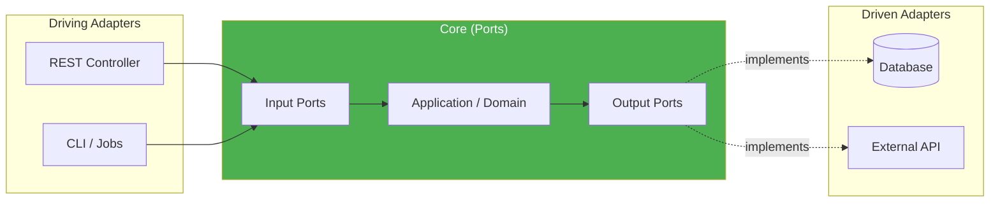

# 🏛️ Architect — Arquitectura

**Proyecto:** allianz  
**Fase:** Architect  
**Fecha:** 2026-05-18 19:09:07  
**URL:** https://github.com/jpguaqueta12/allianz.git  

---

## Resumen

| Campo | Valor |
|---|---|
| Estilo de Despliegue | Microservicio (MEDIA) |
| Patrón Principal | Hexagonal — Score: 16/100 |
| Confianza | BAJA |
| Violaciones | 0 |
| Servicios (monorepo) | 0 |

### Evidencia Detectada

- Código: `(?i)interface\s+\w+Port\b` en 1 archivo(s)

## Patrones Secundarios

| Patrón | Score | Confianza |
|---|---|---|
| MVC | 16 | BAJA |
| Layered | 14 | BAJA |

## Patrones de Diseño (GoF)

| Patrón | Implementaciones | Archivos (muestra) |
|---|---|---|
| Observer | 1 | back-planificacion/app/services/cache_service.py |
| Middleware | 2 | front-planificacion/src/stores/authStore.ts, back-planificacion/app/main.py |

## Comunicación Externa

| Protocolo | Archivos |
|---|---|
| HTTP/REST | 3 |

## Diagrama de Arquitectura

---

*Generado por Agencia de Transición — 2026-05-18 19:09:07*
