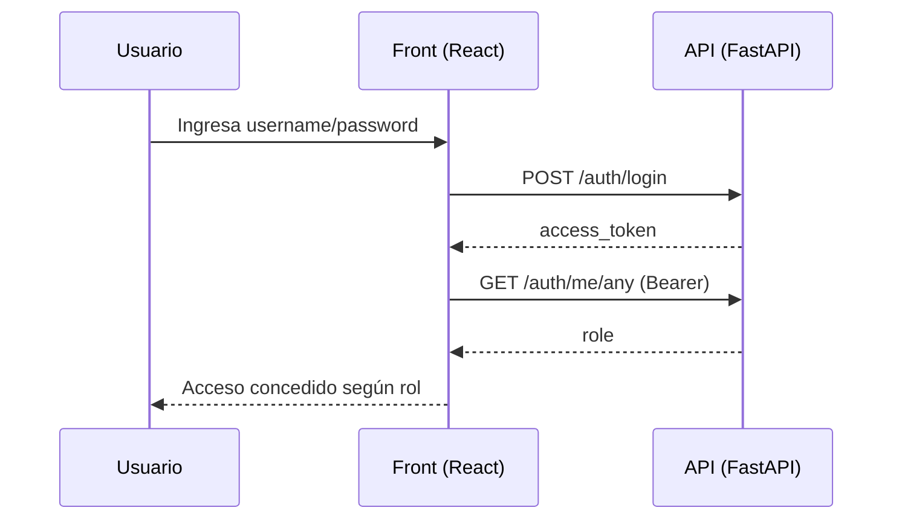
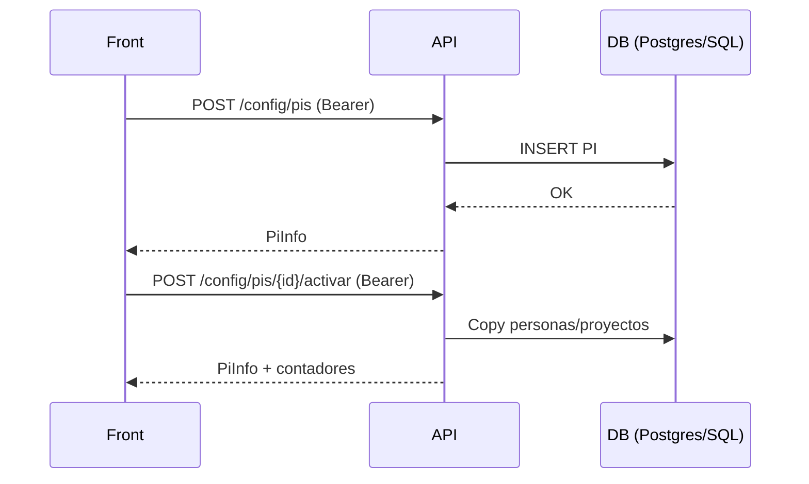
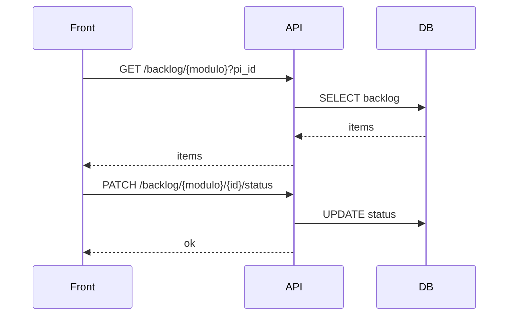

# 🔄 Functional Flow — Flujos Funcionales del Sistema

**Proyecto:** allianz  
**Fase:** Functional Flow  
**Fecha:** 2026-05-18  
**RUN_DIR:** `.axetrules/output/allianz/2026-05-18_19-09-05/`  
**CLONE_DIR:** `/tmp/repo-intel/allianz@main/`  

---

## 📌 Resumen Ejecutivo

Este documento reconstruye los **flujos funcionales principales** del sistema desde evidencia estática disponible (principalmente endpoints consumidos por el frontend). Describe:

- Disparadores (qué inicia el flujo)
- Pasos del happy path
- Excepciones críticas (qué puede fallar y qué pasa)
- Sistemas y componentes participantes (frontend, API, DBs)
- Reglas de negocio inferidas que deben validarse en KT

**Conclusión:** el sistema se comporta como una **plataforma de planificación** con núcleo en:
1) Gestión de PIs (configuración de periodo)
2) Gestión de capacidad (personas + disponibilidad)
3) Gestión de backlog por módulos + planificación + SLA/escalamientos
4) Reporting (dashboards, alertas, SLA)
5) Flujos auxiliares: cargas Excel, estimación IA, export Word

> Estado de evidencia: **PARCIAL**. Los flujos se infieren por rutas consumidas en `front-planificacion/src/services/api.ts` y dependencias declaradas. Debe confirmarse con routers FastAPI y sesiones KT.

---

## 🔎 Evidencia Analizada

- `07_app-inventory/application_inventory_report.md` (inventario: front + back)
- `08_dependency-mapping/dependency_map_report.md` (DBs: Postgres/Redis/SQL Server; IA)
- `09_api-integration/api_integration_report.md` (catálogo de endpoints)
- `10_business-capability/business_capability_report.md` (capabilities y criticidad)
- Evidencia directa: `front-planificacion/src/services/api.ts`

---

## 🧭 Mapa de flujos identificados

| # | Flujo | Capability asociada | Criticidad | Estado de completitud |
|---:|---|---|---|---|
| F-01 | Autenticación y verificación de rol | AuthN/AuthZ | 🔴 | 🟡 PARCIAL (solo cliente) |
| F-02 | Gestión de PIs (crear/editar/activar/borrar) | Configuración de PI | 🔴 | 🟡 PARCIAL |
| F-03 | Gestión de festivos del PI | Festivos | 🟡 | 🟡 PARCIAL |
| F-04 | Gestión de capacidad (personas + sincronización) | Capacidad de personas | 🔴 | 🟡 PARCIAL |
| F-05 | Gestión de novedades de disponibilidad | Novedades disponibilidad | 🟠 | 🟡 PARCIAL |
| F-06 | Gestión de proyectos dentro del PI | Proyectos PI | 🟡 | 🟡 PARCIAL |
| F-07 | Backlog (listar/crear/actualizar/borrar) | Gestión de backlog | 🔴 | 🟡 PARCIAL |
| F-08 | Planificación detallada del ticket | Gestión de backlog | 🔴 | 🟠 FRAGMENTADO |
| F-09 | Escalamiento / pausa SLA | Gestión de backlog / SLA | 🟠 | 🟠 FRAGMENTADO |
| F-10 | Dashboards / Alertas / SLA | Reporting | 🟠 | 🟡 PARCIAL |
| F-11 | Carga/analítica/importación Excel | Importación Excel | 🟡 | 🟡 PARCIAL |
| F-12 | Estimación IA + export Word | Estimación / Export | 🟡 | 🟡 PARCIAL |
| F-13 | Sesión/Chat | Chat | 🟠 | 🟡 PARCIAL |

---

## F-01 — Autenticación y verificación de rol (🔴)

**Disparador:** usuario ingresa credenciales.  
**Resultado esperado:** obtener token JWT y validar rol (`superuser`/`user`) para habilitar funciones admin.

### Happy path

1. Frontend → `POST /api/v1/auth/login` con `{ username, password }`
2. Backend → valida credenciales, retorna `{ access_token, token_type }`
3. Frontend → persiste token en `localStorage['auth-storage']` con expiración (`expiresAt`)
4. Frontend → `GET /api/v1/auth/me/any` usando `Authorization: Bearer <token>`
5. Backend → responde `{ role }`
6. Frontend → habilita rutas/acciones según rol

### Excepciones críticas

- Credenciales inválidas → backend retorna `{detail}`; el cliente muestra “Credenciales incorrectas”.
- Token expirado (cliente) → se borra `auth-storage`; se fuerza nuevo login.
- Token inválido (server) → `verifyToken()` retorna `{ valid:false }`.

### Reglas de negocio inferidas (validar)
- Solo `superuser` puede ejecutar acciones de configuración (`/config/*`) y capacidad.
- Expiración de token se evalúa **client-side** (riesgo si no hay enforcement server-side).

### Diagrama (secuencia)

---

## F-02 — Gestión de PI (crear/editar/activar/borrar) (🔴)

**Disparador:** usuario admin gestiona periodos de planificación.  
**Resultado esperado:** PI creado/actualizado y opcionalmente activado como PI vigente.

### Happy path

1. Frontend → `GET /config/pis` (lista PIs)
2. Admin → crea PI: `POST /config/pis` (auth)
3. Admin → actualiza PI: `PUT /config/pis/{piId}` (auth)
4. Admin → activa PI: `POST /config/pis/{piId}/activar` (auth)
5. Sistema → copia (inferido) personas/proyectos a PI activado (`personas_copiadas`, `proyectos_copiados`)

### Excepciones críticas
- PI inválido (fechas, horas) → error `{detail}`.
- Activación falla por ausencia de datos base → retorna error.
- Borrado (`DELETE /config/pis/{piId}`) es destructivo.

### Reglas de negocio inferidas (validar)
- Solo un PI activo a la vez (implícito).
- Activación realiza “bootstrap” de capacidad/proyectos.

---

## F-03 — Gestión de festivos del PI (🟡)

**Endpoints:** `GET/POST /config/pis/{piId}/festivos`, `DELETE /festivos/{festivoId}` (auth en POST/DELETE)

**Excepciones:** fecha inválida/duplicada; conflictos con calendario laboral.

---

## F-04 — Gestión de capacidad (personas + sincronización) (🔴)

**Disparador:** admin gestiona capacidad por PI.  
**Resultado esperado:** personas creadas y capacidad sincronizada para planificación.

### Happy path

1. Crear persona: `POST /config/pis/{piId}/capacidad/nueva-persona` (auth)
2. Actualizar capacidad: `PATCH /config/pis/{piId}/capacidad/personas/{personaId}` (auth)
3. Sincronizar: `POST /config/pis/{piId}/capacidad/sincronizar` (auth) → retorna `{ actualizado, horas_por_persona }`
4. (Opcional) eliminar persona: `DELETE /capacidad/personas/{personaId}` (auth)

### Excepciones críticas
- Persona ya existe / constraints
- Sincronización impacta planificación y SLA

### Reglas de negocio inferidas (validar)
- Capacidad se expresa en horas.
- Existen reservas para estimación (`reserva_estimacion_*`).

---

## F-05 — Novedades de disponibilidad (🟠)

**Disparador:** registrar ausencias/variaciones por persona para impactar capacidad.  
**Resultado esperado:** novedades aplicadas al cálculo de capacidad.

**Happy path:** `GET` (sin auth en cliente) + `POST/DELETE` (auth).  
**Excepciones:** solapes de fechas; rangos inválidos.

---

## F-06 — Proyectos en PI (🟡)

**Disparador:** asociar proyectos a un PI.  
**Endpoints:** `POST /proyectos/nuevo` y `DELETE /proyectos/{id}` (auth).

---

## F-07 — Backlog (listar/crear/actualizar/borrar) (🔴)

**Disparador:** operación diaria de planificación por módulo (ej: “mc”, “fabrica”, etc.).  
**Resultado esperado:** tickets creados, actualizados y planificados con fechas/estados/escalados.

### Happy path (mínimo)

1. Listar backlog: `GET /backlog/{modulo}?pi_id=...`
2. Crear ticket: `POST /backlog/{modulo}?pi_id=...` con `CreateBacklogData`
3. Asignar fecha: `PATCH /backlog/{modulo}/{ticketId}/fecha-asignacion`
4. Actualizar status: `PATCH /backlog/{modulo}/{ticketId}/status`
5. Gestionar escalamiento: `PATCH /backlog/{modulo}/{ticketId}/escalamiento`
6. Planificación: `PUT /backlog/{modulo}/{ticketId}/planificacion`
7. Borrado: `DELETE /backlog/{modulo}/{ticketId}`

### Excepciones críticas
- Validaciones por módulo/estado (no evidenciadas)
- Concurrencia (múltiples planificadores)
- Operaciones destructivas (DELETE)

### Riesgo importante
El cliente usa `fetch()` (sin `authFetch`) para casi todas las rutas `/backlog/*`.
Si el backend **no valida auth server-side**, la capacidad crítica “Gestión de Backlog” podría quedar expuesta.

---

## F-08 — Planificación detallada del ticket (🔴, 🟠 FRAGMENTADO)

**Evidencia:** existe payload `PlanificacionData`/`PlanificacionItem` y endpoint `PUT /planificacion`.  
**Falta:** reglas de negocio (cómo se calculan fechas finales, ETC, reservas por perfil).

**Preguntas KT sugeridas**
- ¿Cómo se calcula `fecha_finalizacion` vs `fecha_finalizacion_inicial`?
- ¿Qué representa `etc` (effort to complete) y cómo se actualiza?
- ¿Qué perfiles/fases existen realmente además de `desarrollo`?

---

## F-09 — Escalamiento / pausa SLA (🟠, 🟠 FRAGMENTADO)

**Evidencia:** `EscalamientoData` con lista de `escalados` y respuesta con fechas (`fecha_escalado`, `fecha_reinicio`).  
**Falta:** reglas SLA (pausas, reinicios, condiciones de escalado).

---

## F-10 — Reporting: Dashboards, Alertas, SLA (🟠)

**Disparador:** consulta de indicadores de operación por PI/módulo.  
**Happy path:** `GET /dashboard*`, `GET /alertas/{modulo}`, `GET /sla/{modulo}`.

**Excepciones:** falta de PI activo; inconsistencias de datos; performance.

---

## F-11 — Carga/analítica/importación Excel (🟡)

**Disparador:** usuario sube Excel de backlog o incidentes.  
**Happy path:**

1. Analizar: `POST /upload/analizar-backlog` (multipart) → preview/analítica
2. Importar: `POST /upload/importar-backlog`
3. Similar para incidentes y preview genérico: `/upload/preview-excel`

**Excepciones críticas**
- Archivos grandes → timeouts/memoria
- Duplicados (se reportan duplicados en payloads)
- Validación de columnas/formatos

---

## F-12 — Estimación IA + export Word (🟡)

**Disparador:** usuario solicita estimar un requerimiento; adjunta fuentes (PDF/Word/etc.).  
**Happy path:**

1. Extraer texto: `POST /estimation/extract-file` (multipart)
2. Estimar: `POST /estimation/estimar` (JSON)
3. Exportar: `POST /estimation/export-word` (JSON) → blob docx

**Dependencias externas:** LLM provider (inferido por `langchain-openai`/`langgraph`).

---

## F-13 — Sesión/Chat (🟠)

**Happy path:**
1. Crear sesión: `POST /session` (no auth en cliente)
2. Enviar mensaje: `POST /chat` (no auth en cliente) → retorna `stream_url`

**Riesgos:** exposición de chat si backend no aplica auth; costos por IA.

---

## ⚠️ Excepciones críticas transversales (a validar)

1) **Autorización server-side en endpoints críticos** (`/backlog/*`, `/dashboard*`, `/upload/*`, `/chat`)  
2) **Idempotencia y concurrencia** en updates de backlog (PATCH/PUT)  
3) **Integridad referencial** entre PI, personas, proyectos, tickets  
4) **Performance** en dashboards y reportes SLA (queries grandes)  
5) **Auditoría** de operaciones destructivas (DELETE PI / DELETE backlog item)

---

## ✅ Recomendaciones priorizadas (para completar flujos)

### P1 (Día 1)
- Confirmar enforcement de AuthN/AuthZ en backend para backlog/config/chat/uploads.
- Documentar reglas core: PI activo, cálculo de capacidad, cálculo SLA y escalamiento.

### P2 (Semana 1-2)
- Crear runbooks operativos por flujo crítico: “Backlog”, “Capacidad”, “PI”.
- Formalizar contrato OpenAPI por tags (auth, backlog, config, sla, upload, estimation).

---

## Limitaciones

- Flujos reconstruidos principalmente desde cliente frontend; faltan routers/controladores backend.
- No hay evidencia de runtime (logs, métricas, eventos reales).

---

*Generado por Agencia de Transición — 2026-05-18*
