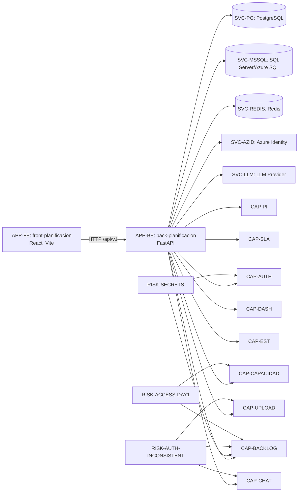

# 🧠 Knowledge Graph — Base de Conocimiento (Grafo)

**Proyecto:** allianz  
**Fase:** Knowledge Management  
**Fecha:** 2026-05-18  
**RUN_DIR:** `.axetrules/output/allianz/2026-05-18_19-09-05/`  

---

## 📌 Objetivo

Consolidar el conocimiento generado por la agencia en un **grafo navegable**: entidades clave (apps, servicios, APIs, capacidades, flujos, riesgos) y sus relaciones.

> Nota: este grafo se construye desde evidencia estática (outputs CORE + análisis extendido). Debe enriquecerse con KT y evidencias de runtime (URLs reales, owners, SLAs, monitoreo).

---

## 🔎 Fuentes (evidencia)

- `01_scout/projects_discovered.md`
- `02_analyst/stack_quality_report.md`
- `03_architect/architecture_report.md`
- `04_auditor/security_report.md`
- `05_strategist/TRANSITION_ROADMAP.md`
- `06_access-readiness/access_readiness_report.md`
- `07_app-inventory/application_inventory_report.md`
- `08_dependency-mapping/dependency_map_report.md`
- `09_api-integration/api_integration_report.md`
- `10_business-capability/business_capability_report.md`
- `11_functional-flow/functional_flow_report.md`

---

## 🧩 Entidades (nodos)

### Applications / Componentes

| ID | Tipo | Nombre | Stack | Evidencia |
|---|---|---|---|---|
| APP-FE | Frontend SPA | `front-planificacion` | React + Vite + TS | App Inventory + Dependency Mapping |
| APP-BE | Backend API | `back-planificacion` | Python + FastAPI | Analyst + App Inventory |

### Servicios / Dependencias de infraestructura

| ID | Tipo | Nombre | Criticidad | Evidencia |
|---|---|---|---:|---|
| SVC-PG | DB | PostgreSQL | 🔴 | Dependency Mapping |
| SVC-MSSQL | DB | SQL Server / Azure SQL | 🔴 | Dependency Mapping + Auditor (scripts con credenciales) |
| SVC-REDIS | Cache/Store | Redis | 🟠 | Dependency Mapping |
| SVC-AZID | IAM | Azure Identity / AAD | 🟠 | Dependency Mapping |
| SVC-LLM | Externo | LLM Provider (OpenAI/compatible) | 🟠 | Dependency Mapping (langchain-openai/langgraph) |

### Dominios / Capacidades de negocio

| ID | Capability | Criticidad | Evidencia |
|---|---|---:|---|
| CAP-AUTH | Autenticación y autorización | 🔴 | Business Capability + API Integration |
| CAP-PI | Configuración de PI | 🔴 | Business Capability + Functional Flow |
| CAP-CAPACIDAD | Capacidad de personas | 🔴 | Business Capability + API Integration |
| CAP-BACKLOG | Gestión de backlog | 🔴 | Business Capability + Functional Flow |
| CAP-SLA | SLA / Alertas | 🟠 | Business Capability + API Integration |
| CAP-DASH | Dashboards | 🟠 | Business Capability + API Integration |
| CAP-UPLOAD | Importación Excel | 🟡 | Business Capability + API Integration |
| CAP-EST | Estimación IA / export Word | 🟡 | Business Capability + API Integration |
| CAP-CHAT | Sesión/Chat | 🟠 | Business Capability + API Integration |

### Flujos funcionales

| ID | Flujo | Estado | Criticidad | Evidencia |
|---|---|---|---:|---|
| FLOW-AUTH | Autenticación y verificación de rol | 🟡 PARCIAL | 🔴 | Functional Flow |
| FLOW-PI | Gestión de PIs | 🟡 PARCIAL | 🔴 | Functional Flow |
| FLOW-CAP | Gestión de capacidad + sincronización | 🟡 PARCIAL | 🔴 | Functional Flow |
| FLOW-BACKLOG | CRUD Backlog + cambios estado/fechas | 🟡 PARCIAL | 🔴 | Functional Flow |
| FLOW-PLAN | Planificación detallada | 🟠 FRAGMENTADO | 🔴 | Functional Flow |
| FLOW-ESC | Escalamiento / Pausa SLA | 🟠 FRAGMENTADO | 🟠 | Functional Flow |
| FLOW-UPLOAD | Upload/Analítica/Import Excel | 🟡 PARCIAL | 🟡 | Functional Flow |
| FLOW-EST | Estimación + export Word | 🟡 PARCIAL | 🟡 | Functional Flow |
| FLOW-CHAT | Sesión/Chat | 🟡 PARCIAL | 🟠 | Functional Flow |

### Riesgos / Hallazgos

| ID | Riesgo | Severidad | Evidencia |
|---|---|---:|---|
| RISK-SECRETS | Secretos expuestos en código (3) | 🔴 | Auditor |
| RISK-AUTH-INCONSISTENT | Cliente consume rutas críticas sin `authFetch` | 🔴 | API Integration + Functional Flow |
| RISK-ACCESS-DAY1 | Accesos no evidenciados a DBs/observabilidad/secret manager | 🔴 | Access Readiness |
| RISK-SPOF-DB | Dependencias DB/Redis sin evidencia de HA | 🟠 | Dependency Mapping |
| RISK-LLM-EXT | Dependencia externa LLM (costos, rate limits) | 🟠 | Dependency Mapping |

---

## 🔗 Relaciones (edges)

### Mapa lógico (texto)

- `APP-FE` **CALLS** `APP-BE` (HTTP REST `/api/v1/*`)
- `APP-BE` **DEPENDS_ON** `SVC-PG`, `SVC-MSSQL`, `SVC-REDIS`
- `APP-BE` **USES** `SVC-AZID` (autenticación/identidad para Azure, inferido)
- `APP-BE` **CALLS** `SVC-LLM` para `CAP-EST` y `CAP-CHAT` (inferido por libs)

- `APP-BE` **ENABLES** capabilities:
  - `CAP-AUTH`, `CAP-PI`, `CAP-CAPACIDAD`, `CAP-BACKLOG`, `CAP-SLA`, `CAP-DASH`, `CAP-UPLOAD`, `CAP-EST`, `CAP-CHAT`
- `FLOW-*` **INVOLVES** `APP-FE` y `APP-BE` (todos los flujos principales)

- `RISK-SECRETS` **THREATENS** `CAP-AUTH` + `CAP-PI` + `CAP-BACKLOG` (por credenciales expuestas)
- `RISK-AUTH-INCONSISTENT` **THREATENS** `CAP-BACKLOG` + `CAP-UPLOAD` + `CAP-CHAT`
- `RISK-ACCESS-DAY1` **BLOCKS** operación de `CAP-BACKLOG`/`CAP-CAPACIDAD` (sin accesos a DBs/observabilidad)

---

## 🗺️ Diagrama Mermaid (grafo)

---

## 🔧 Gaps para enriquecer el grafo (KT / Operación)

1) Owners reales por componente (equipo, guardia, escalación).
2) URLs reales (dev/qa/prod) para FE/BE.
3) Inventario real de entornos (K8s/VM/PaaS) y pipeline de deploy.
4) Contrato OpenAPI extraído del backend (`/openapi.json`) y versionado.
5) Confirmación de AuthZ server-side por endpoint crítico (backlog/uploads/chat).

---

*Generado por Agencia de Transición — 2026-05-18*
